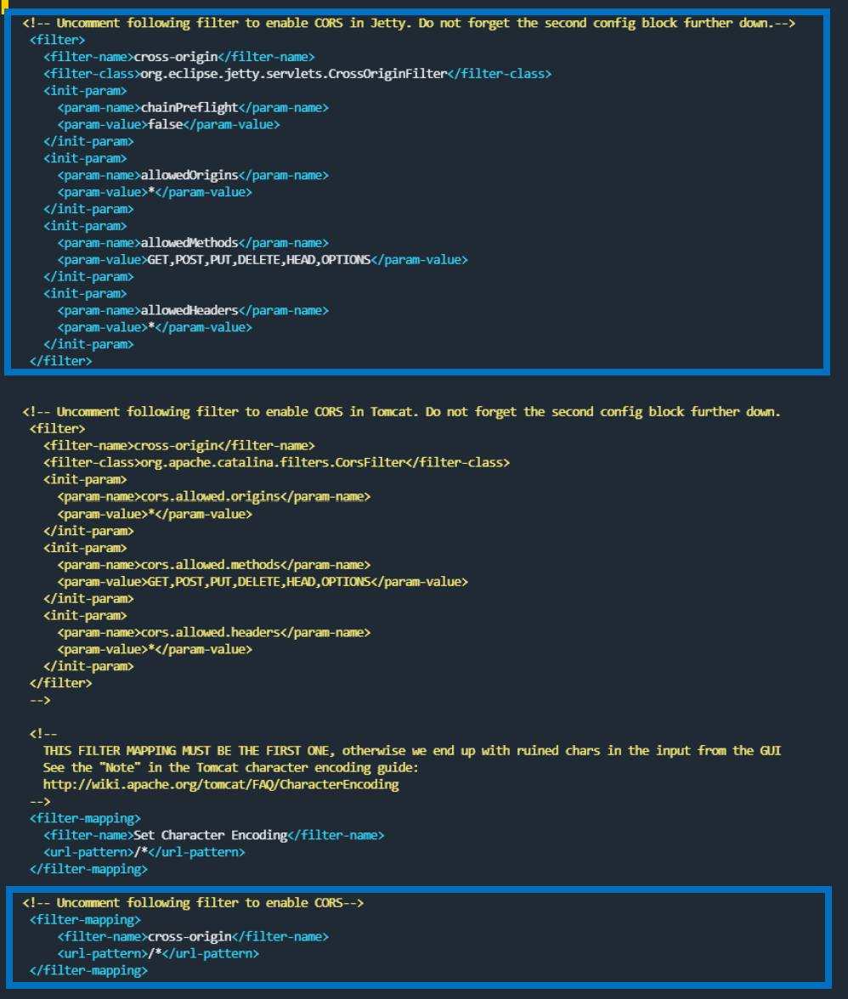

# GDI_Project
Server Client Projekt für eine Geodateninfrastruktur Webportal im Rahmen des Moduls 4230

- **Frontend:** React.js, OpenLayers, Axios und MUI
- **Backend:** Python-Libraries: (BeautifulSoup, Selenium, Requests, psycopg2, JSON, CSV), GeoServer, PostgreSQL, PostGIS

GitHub Pages: https://naamp.github.io/4230_FootballMap/

Getestet mit Node version 21.7.1, openlayers 9.1.0

## Requirements

- [Git](https://git-scm.com/)
- IDE wie [Visual Studio Code](https://code.visualstudio.com/)
- [Anaconda Distribution](https://www.anaconda.com/products/distribution) oder [Miniconda](https://docs.conda.io/en/latest/miniconda.html)
- Node.js und npm ([https://docs.npmjs.com/downloading-and-installing-node-js-and-npm](https://docs.npmjs.com/downloading-and-installing-node-js-and-npm))

## Repository lokal klonen
Mit Git in einem Terminal das GitHub Repository *Geoharvester* in ein lokales Verzeichnis klonen.

``` shell
cd /path/to/workspace
# Clone Repository
git clone https://github.com/314a/GDI_Project.git
```

### Git Projekt mit Visual Studio Code lokal klonen
Öffne ein neues Visual Studio Code Fenster und wähle unter Start *Clone Git Repository*. Alternativ öffne die Command Palette in VS Code `CTRL+Shift+P` (*View / Command Palette*) und wähle `Git: clone`.
Füge die Git web URL `https://github.com/314a/GDI_Project.git` ein und bestätige die Eingabe mit Enter. Wähle einen Ordner in welchen das Repository *geklont* werden soll.


## Backend installieren
Öffne ein Terminal und wechsle in den *server* Ordner.
1. Virtuelle Umgebung für Python mit allen Requirements in der `requirements.txt` Datei aufsetzen.

```shell
# Requirements
cd server
# Füge conda-forge den als Channel in conda hinzu, da sonst nicht alle Pakete installiert werden können.
conda config --add channels conda-forge
# Erstelle ein neues Conda Environment und füge die Python Packges requirements.txt hinzu, requirements.txt befindet sich im Ordner server/app
conda create --name gdiproject python=3.10.9 --file app/requirements.txt
```

2. Backend ausführen, virtuelle Umgebung starten und server *uvicorn* starten. Öffne http://localhost:8000/docs im Browser und verifiziere, ob das Backend läuft.
``` shell
cd server
# aktiviere die conda umgebung gdiproject
conda activate gdiproject
# start server auf localhost aus dem Ordner "server"
uvicorn app.main:app --reload
# Öffne die angegebene URL im Browser und verifiziere, ob das Backend läuft.
```

3. Daten in lokale Datenbank importieren
- Schritt 1: Räumliches Dataenbankmanagementsystem (GeoDBMS) installieren, z.B. PostgreSQL (https://www.postgresql.org/download/) mit Postgis und pgAdmin (https://postgis.net/)

- Schritt 2: Datenbank "footballmap" erstellen mit SQL-Statement:
CREATE DATABASE footballmap

- Schritt 3: Datenbankschema und Daten importieren:
SQL-Statement von der [Datei "footballmap_v4_database-dump.sql"](preprocessing/Database/) kopieren und ausführen. Bei Fehlermeldungen zu Gott beten oder ein Kaffe trinken und von vorne beginnen.

4. Daten mittels Geoserver freigeben
- Schritt 1: Geoserver installieren (https://geoserver.org/)
Der GeoServer basiert auf Java und benötigt eine funktionierende Java 11 Umgebung, z.B. von hier: https://adoptium.net/de/temurin/releases/

Bei der Datei unter dem Windows-Pfad C:\GeoServer\webapps\geoserver\WEB-INF\web.xml zwei Abschnitte gemäss folgendem Bild auskommentieren


- Schritt 2: Geoserver einrichten:
Webumgebung öffnen: http://localhost:8080/geoserver/web/
    - Arbeitsbereich "footballmap" mit URI "http://geoserver.org/footballmap" eröffnen
    - Datenspeicher "footballmap" eröffnen und Verbindung zu PostGIS aufbauen
    - folgende Layer freigeben, dabei EPSG:4326 wählen und Boundingbox (Aus den Grenzen des Koordinatenreferenzsystems berechnen) definieren, auch wenn die Daten teilweise keine Geodaten enthalten. Dabei die nahmen genau wie folgt übernehmen:
        - land
        - vw_club_all
        - vw_spieler_geburtsland
        - vw_spielerdaten
        - vw_transferlinien


## Frontend installieren
Öffne ein Terminal (Command Prompt in VS Code) und wechsle in den *client* Ordner in diesem Projekt

``` shell
cd client
# aktiviere node.js (falls nvm genutzt wird)
# nvm use 20.11.1
# install all the node.js dependencies
npm install
# node Projekt ausführen
# npm start ist in package.json definiert
npm start
```


Viel Gelduld, Glück und ausreichend Nervenvermögen bei der Installation. 
Ist es geschafft, wünschen wir dir viel Spass beim Entdecken der coolen footballmap.