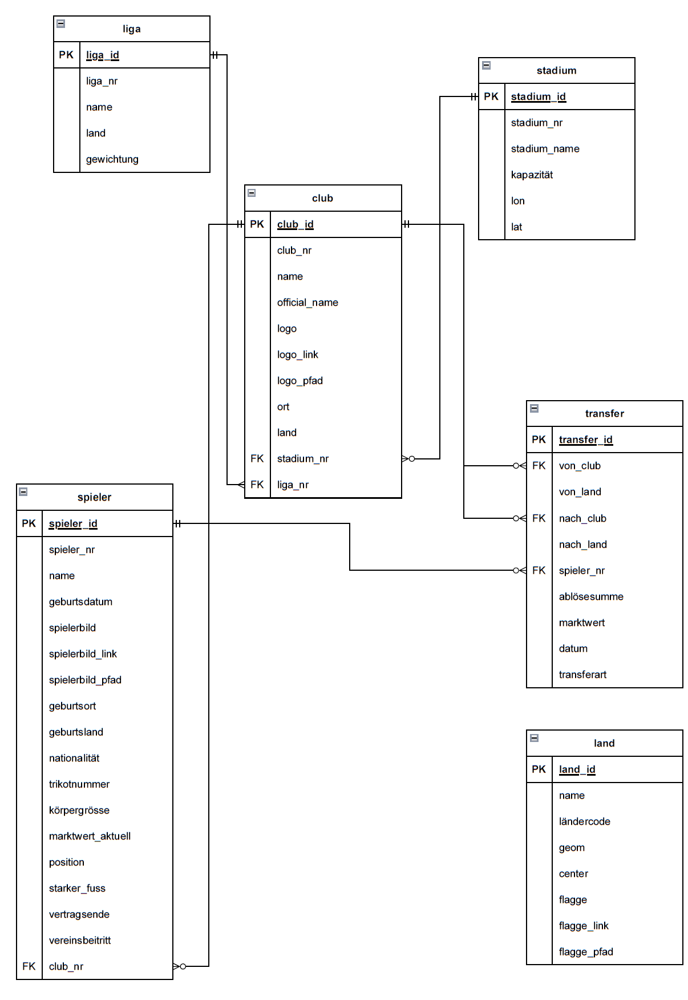

# Aufbau Geodateninfrastruktur (GDI)

Eine komplette Geodateninfrastruktur (GDI) besteht aus dem Backend, dem Frontend und den verwendeted Libraries und API Schnittstellen. Das folgende Schema zeigt die aufgebaute und verwendete Geodateninfrasturktur der FootballMap auf.

## Backend

Das Backend beinhaltet alle unsichtbaren Inhalte und Daten, die sich auf dem Server (bei uns Raspberry Pi) befinden. Dazu gehört auch der Bezug von Geodaten und sonstigen Daten über eine API-Schnittstelle oder per Web-Scraping. Das konzipierte Datenbankschema (siehe Bild unten) wurde mit postgres und postgis erstellt und die Daten wurden mittels Python-Skripts in die Datenbank eingepflegt. Der Geoserver ist das Bindeglied und der Bereitsteller der Datenbank. Mit Java Script React wird über den Geoserver auf die Daten zugegriffen und schlussendlich im Frontend dargestellt.

### Grundlagedaten

Um die erwähnten Funktionen der FootballMap umsetzten zu können, werden Fussballdaten benötigt. Ligen, Vereine, Stadien, Spieler und deren Transfers sollen in Form von strukturierten Daten erfasst und gespeichert werden. Transfermarkt.ch bietet seit 2001 eine Webseite mit umfassenden Daten rund um den Sport Fussball an. Die Grundlagedaten für die FootballMap beruhen deshalb auf Daten von Transfermarkt.ch.

#### Datenabfrage über API-Schnittstelle

Die Daten von Transfermarkt.ch konnten bis am 31. März 2024 über die API-Schnittstelle [Transfermarkt-API](https://transfermarkt-api.vercel.app/) bezogen werden. Liga-, Vereins- und Spielerdaten konnten über folgende Abfragen gefiltert und angezeigt werden. Der Zugang zu dieser API wurde nach dem 31. März 2024 geschlossen. Die Daten zu den Ligen, Vereinen und Stadien sind die Grundlage zur Darstellung der Club Logos auf der Startseite der FootballMap. Ausserdem werden diese Daten auch für die weiteren Funktionen [Squad Overview](#squad-overview) und [Transfer History](#transfer-history) benötigt.

***Beispielabfragen:***

- ***Suche eines Wettbewerbs (Liga):***
  `https://transfermarkt-api.vercel.app/competitions/search/Super%20League`

- ***Abfrage Vereine eines Wettbewerbs:***
  `https://transfermarkt-api.vercel.app/competitions/{Wettbewerbs_ID}/clubs`

- ***Abfrage Daten eines Vereins:***
  `https://transfermarkt-api.vercel.app/clubs/{Club_ID}/profile`

- ***Abfrage Spieler eines Vereins:***
  `https://transfermarkt-api.vercel.app/clubs/{Club_ID}/players`

- ***Abfrage Spielerprofil:***
  `https://transfermarkt-api.vercel.app/players/{Spieler_ID}/profile`

- ***Abfrage Transfers eines Spielers:***
  `https://transfermarkt-api.vercel.app/players/{Spieler_ID}/transfers`

Die Liga- und Vereinsdaten der FootballMap-Datenbank wurden über die Transfermarkt-API bezogen. Im Repository-Ordner (preprocessing/TransfermarktAPI_requests) befinden sich die Python-Skripts zur Abfrage und Speicherung der Daten. Es werden die Libraries [requests](https://pypi.org/project/requests/), [json](https://docs.python.org/3/library/json.html), [csv](https://docs.python.org/3/library/csv.html) und [pycopg2](https://pypi.org/project/psycopg2/) verwendet.

- `01_TM-API_AlleLigen_2_Liste_club_ids.py`
  - ***Grundlagedatei:*** JSON der Ligen jeweils mit dem Attribut Liga_nr
  - ***Zieldatei:*** Liste mit allen Club Nummern (Club_nr) aus jeder Liga (Liga_nr)
  - Es wurden die relevantesten Fussballländer in Europa mittels [UEFA Ranking](https://www.uefa.com/nationalassociations/uefarankings/country/?year=2024) ausgewählt
  - Von den besten fünf Ländern wurden jeweils die obersten drei Ligen ausgewählt, bei den weiteren 15 Ländern jeweils die obersten zwei Ligen, von weiteren 18 Ländern jeweils die oberste Liga
  - In der Schweiz wurden die obersten fünf Ligen mit einbezogen

- `02_TM-API_Liste_club_nr_2_JSON.py`
  - ***Grundlagedatei:*** Liste mit Club Nummern (Club_nr)
  - ***Zieldatei:*** JSON mit Club Informationen
  - Jeder Club wird abgefragt, um ein Clubprofil mit Attributen wie Clubname, Stadionname und Adresse zu erstellen

Im File 02 wird pro Club das Clubprofil abgerufen und die jeweiligen Attribute wie Clubname, Stadionname, Adresse werden abgefragt. Die Adresse und der Stadionname werden als Parameter einer Abfrage der [Nominatim API](https://nominatim.org/release-docs/develop/api/Search/) hinzugefügt. Die Nominatim API von Open Street Map lokalisiert die Stadien und die passenden Koordinaten werden im Clubprofil gespeichert. Falls mit den Parametern (Stadt, Stadionname und Typ="stadium") kein Eintrag gefunden wird, wird das Attribut Stadium_Coordinates mit dem Wert "None" abgefüllt. Die folgenden drei Python-Skripts verwenden andere Parameter, um einen passenden Eintrag zum jeweiligen Stadionnamen zu finden.

- `03_Koord_request_Nominatim_v1.py`
  - ***Parameter:*** Stadionname und Typ="stadium"

- `04_Koord_request_Nominatim_v2.py`
  - ***Parameter:*** Clubname und Typ="stadium"

- `05_Koord_request_Nominatim_v3.py`
  - ***Parameter:*** Stadtname und Country="country"

Falls bei der zweiten Abfrage keine Koordinaten gefunden werden, werden in der dritten Abfrage die Koordinaten der zugehörigen Stadt im Clubprofil gespeichert.
Die finalisierten Clubprofile werden entweder in eine CSV-Datei oder in eine JSON-Datei umgewandelt oder formatiert. Je nach weiterem Anwendungswunsch, kann zwischen CSV und JSON gewählt werden. Für den Import der Daten in die Datenbank wird ein weiteres Skript (07_Clubs_json2pg.py) verwendet.

- `06_Clubs_json_2_csv.py`
  - ***Grundlagedatei:*** JSON mit Clubprofilen inklusive Koordinaten
  - ***Zieldatei:*** CSV mit Clubprofilen

- `06_Clubs_json_2_json_formatiert.py`
  - ***Grundlagedatei:*** JSON mit Clubprofilen inklusive Koordinaten
  - ***Zieldatei:*** JSON mit Clubprofilen formatiert

- `07_Clubs_json_2_pg.py`
  - ***Grundlagedatei:*** JSON mit Clubprofilen inklusive Koordinaten
  - ***Ziel:*** Daten in Datenbank

Alle Spieler Nummern (Spieler_nr) von Spielern in der Schweizer Super League wurden mit der [Transfermarkt-API](https://transfermarkt-api.vercel.app/) abgefragt und gespeichert. Diese Liste dient als Grundlage für das Web-Scraping der Spielerdaten und der Transferdaten.

- `10_TM-API_AlleSpieler_CH_SuperLeague.py`
  - ***Grundlagedatei:*** Liste mit allen Club Nummern (Club_nr)
  - ***Ziel:*** JSON mit allen Spielern der angegebenen Club Nummern (club_nr)
  - Es wurden alle Spieler der Schweizer Super League in der Datenbank der FootballMap integriert. Die wirklich genutzten Spielerdaten stammen jedoch aus dem [Web-Scraping Sqad Overview](#web-scraping-squad-overview)

#### Web-Scraping Squad Overview

Das Ziel der Seite Squad Overview ist es, alle Spieler eines ausgewählten Vereins anzuzeigen. Von den Spielern sollten mehrere Informationen in einer Tabelle angezeigt werden, wie die Nationalität, Position, Trikotnummer, starker Fuss und Geburtsdatum. Die geforderten Informationen können nicht mehr über die API-Schnittstelle bezogen werden. Als Alternative wird die Technik [Web-Scraping](https://www.ionos.de/digitalguide/websites/web-entwicklung/was-ist-web-scraping/) angewendet. Es werden Daten von Webseiten über den HTML Code und den CSS-Klassen identifiziert und strukturiert abgespeichert. Für die Spielerdaten der FootballMap wurden die Inhalte von Transfermarkt.ch verwendet. Somit können die bestehenden Daten und die bereits verwendeten ID's von Transfermarkt.ch (Spieler_nr) weiterverwendet werden.

Um die oben beschriebenen Daten aus der Webseite zu extrahieren werden die Libraries [beautifulsoup](https://beautiful-soup-4.readthedocs.io/en/latest/), [requests](https://pypi.org/project/requests/) und [json](https://docs.python.org/3/library/json.html) verwendet.

- `04_scrape_playerdata.py`
  - ***Grundlagedatei:*** JSON mit allen Spielernummern (Spieler_nr)
  - ***Ziel:*** JSON mit Spielerprofilen. Attribute: "spieler_nr", "trikotnummer", "name", "geburtsort","geburtsland", "vereinsbeitritt", "vertragsende", "position", "starker_fuss", "geburtsdatum", "körpergrösse","nationalität", "marktwert", "vereinsnummer", "spielerbild_link"

Mit den Funktionen von [requests](https://pypi.org/project/requests/) wird pro Spieler die URL mit der Spieler_nr aufgerufen. Abfrage-URL: "https://www.transfermarkt.ch/spielername/profil/spieler/{Spieler_nr}". Die Antwort der URL Abfrage wird mit [beautifulsoup](https://beautiful-soup-4.readthedocs.io/en/latest/) umgewandelt, sodass Daten aus den einzelnen HTML Elementen extrahiert werden können.

#### Web-Scraping Transfer History

Für die Seite `Transfer History` werden die Transferdaten jedes Spielers von der spezifischen Abfrage-URL "https://www.transfermarkt.ch/spielername/transfers/spieler/{Spieler_nr}" extrahiert. Die Standardabfrage mittels [BeautifulSoup](https://beautiful-soup-4.readthedocs.io/en/latest/) stösst jedoch aufgrund eines speziellen HTML-Elements (`<tm-transfer-history player-id="{spieler_nr}"></tm-transfer-history>`) auf Herausforderungen. Das HTML-Element `<tm-transfer-history>` . Daher wird für das Web-Scraping eine Kombination aus [Selenium](https://selenium-python.readthedocs.io/) und [BeautifulSoup](https://beautiful-soup-4.readthedocs.io/en/latest/) verwendet.

Der Web-Scraping-Prozess erfolgt durch ein [Jupyter Notebook](https://docs.jupyter.org/en/latest/) und nutzt Funktionen der Libraries Selenium und BeautifulSoup:

- ***Notebook:*** `01_Transfermarkt_Transferdata_Notebook.ipynb`
  - ***Ausgangsdatei:*** Liste der Spielernummern (Spieler_nr)
  - ***Ziel:*** CSV mit einer Zeile pro Transfer, die Attribute wie Spieler-Nr., Saison, Datum, abgebender Verein, Name des alten Clubs, aufnehmender Verein, Name des neuen Clubs, Marktwert und Ablösesumme enthält.

Mit Selenium wird ein automatisierter Webdriver betrieben, der durch das Jupyter Notebook gesteuert wird. Es navigiert zur spezifischen Abfrage-URL, integriert eine Wartezeit und akzeptiert die Cookies. Die Datenextraktion erfolgt erneut über BeautifulSoup, wobei die Attribute jeder Tabellenzeile gesichert werden.

Die Attribute für das Ursprungs- und Zielland der Clubs (`old_club_country` und `new_club_country`) wurden manuell zu jedem Transfer hinzugefügt, da diese nicht direkt aus der Tabelle entnommen werden konnten. Eine Erweiterung des Jupyter Notebooks könnte eine verbesserte Navigation einschließen, um diese Informationen automatisch aus den Clubseiten auf [Transfermarkt](https://www.transfermarkt.ch/{Vereinsname}/stadion/verein/{Club_nr}/saison_id/2023) zu ziehen. Ein weiterer Ansatz, das Land des Clubs mittels der [Nominatim API](https://nominatim.org/release-docs/develop/api/Search/) zu ermitteln, schlug fehl, da nur für etwa 10% der Clubs entsprechende Einträge gefunden wurden. Diese Verknüpfung des Landes mit dem Club ist in der Datenbank vorhanden, jedoch sind nicht alle globalen Vereine in der FootballMap-Datenbank erfasst, was bei der Darstellung der Transferhistorie zu Datenlücken führen kann.

#### Web-Scraping aktuelle Liga Tabelle
Ziel ist es, die aktuelle Tabelle der Schweizer Superleague mit einem [Web-Scraping] (https://www.ionos.de/digitalguide/websites/web-entwicklung/was-ist-web-scraping/) zu erhalten, da diese Daten nicht mit der [Transfermarkt-API](https://transfermarkt-api.vercel.app/)bezogen werden konnten. Es sollen die Attribute Rang, Club, Anz. Spiele, gewonnen, verloren, unentschieden, Anz. Tore, Gegentore und die Anzahl Punkte als Attribute von [Transfermarkt](https://www.transfermarkt.ch) bezogen werden. 

- `01_scrape_table.py`
  - **Abfrage-URL:** [Transfermark](https://www.transfermarkt.ch/super-league/tabelle/wettbewerb/C1/saison_id/2023)
  - **Ziel:** JSON mit der aktuellen Tabelle

Das Skript verwendet die Python-Bibliotheken [requests](https://pypi.org/project/requests/) und [BeautifulSoup]( https://beautiful-soup-4.readthedocs.io/en/latest/), um Daten von der Webseite "Transfermarkt" zu extrahieren, die es anschliessend in einer JSON-Datei speichert.
Jedoch wurde dieses Skript nicht mehr weiter verwendet [siehe Kapitel Mockup](#Mockup)

### Datenbank und Datenbankschema

Die dazugehörige SQL-Definition ist im [File](preprocessing/Database/db_footballmap_v4.sql) einzusehen.

Es ist zu erwähnen, dass die Position der Stadien als geographische Koordinaten (lat / lon) erfasst sind und nicht als Punktgeometrie.

Die einzigen Geometrien sind in der Tabelle land mit den Ländergrenzen (multipolygon) und den Zentren der Ländern (point) enthalten. 

#### Tabelle land und Abfrage von Länder-Flaggen
Die Tabelle land enthält die Grundlagedaten der Länder, welche zum einten als Hintergrundkarte bei Player Origin wie auch für die Darstellung von Transferlinien teilweise verwendet wird.

Aus Fussball-Technischen Gründen wurde Grossbritannien in die Länder England, Schottland, Wales und Nordirland aufgeteilt. Ansonsten wurden die Länder-Grenzen unverändert von "Natural Earth" übernommen und in die Datenbank importiert. Für politische Ungereimtheiten bei den Landesgrenzen wird keine Verantwortung übernommen. Die Tabelle land wurde mit den ISO 3166-Ländercodes erweitert, welche als Identifikation für die Abfrage der Länder-Flaggen verwendet wurde. Die Flaggen wurden von der [API]("https://www.welt-flaggen.de/herunterladen/api") bezogen. Der Import in die Datenbank wurde mit dem File "preprocessing/Database/flag2db.ipynb" grösstenteils mittels Python erledigt. Die Flaggen wurden als Binär-Bild, als online-Link und als lokalen Pfad in die Datenbank abgespeichert.

#### Import Fussballdaten in die Datenbank
Die Daten aus dem Scraping entstandenen Zieldateien (.json) wurden in die Datenbank importiert. Als Schnittstelle wurde das File "preprocessing/Database/json2db.ipynb" verwendet, welches grösstenteils die Daten mittels Python direkt in die Datenbank schreibt. Das File ist Schrittweise aufgebaut und erlaubt dem Benutzer, die Daten Schritt für Schritt in der Datenbank entweder gesamthaft oder nach einzelnen Tabellen zu aktualisieren. Dabei ist zu erwähnen dass die gescrapten Daten teilweise unenheitlich und schlecht strukturiert waren. Einige Spezialfälle wurden bereits abgedeckt, jedoch tauchten bei jeder Aktualisierung wieder neue Probleme auf, die eine vollständige Automatisierung verunmöglichte. Beispielsweise wurde der Marktwert als "600 Tsd." gescrapt, diese Art von Zahlen mussten in eine numerische Zahl (600000) umgewandelt werden. Ein weiteres Beispiel stellen die erfassten Daten dar. Diese mussten von der Form "Dec 31, 1998" nach "31.12.1998" umgewandelt werden.

Auf diese Art können die Tabellen stadium, liga, club, spieler und transfer aktualisiert werden.

#### Datenbankabfragen (DB-Views)
Insgesamt wurden 4 DB-Views definiert, welche als Schnittstelle zwischen den Daten in den Datentabellen und dem Frontend dienen werden:
- vw_club_all
- vw_spielerdaten
- vw_spieler_geburtsland
- vw_transferlinien

Die DB-Views dienen zum einen für die Abfrage und die Filterung von Daten aus mehreren Tabellen und zum anderen für die Erstellung von Geometrien mittels Postgis-Befehlen. Mittels Postgis-Befehl "ST_MakePoint" werden die Standorte der Stadien im View "vw_club_all" von lat/lon als Geometrie (point) umgewandelt. 

Die Transferlinien werden als Geometrie (line) mittels Postgis-Befehlen "ST_MakePoint" und "ST_MakeLine" im View "vw_transferlinien" gezeichnet. Es werden grundsätzlich die Linien zwischen den Club-Positionen "von_club" nach "nach_club" definiert. Sind die Clubs jedoch "unbekannt" (Nummer 999999), dann werden als Ersatz die Zentren der Länder verwendet. Weiter werden Transferlinien mit der Länge von 0 weggefiltert. Dies ist der Fall, wenn ein Spieler von einem unbekannten zu einem anderen unbekannten Club innerhalb des gleichen Landes wechselt. In den meisten Fällen betrifft dies den Wechsel innerhalb Jugendmannschaften (z.B. Sparta Praha U18 nach Sparta Praha U19). Diese Transfers sollen bewusst nicht dargestellt werden.

### Geoserver

## Frontend

### React

Wie greift React mit Axios auf die Daten(Geoserver) zu

### Open Layers

Wie werden die Daten des Geoservers mit OL dargestellt?

### UI Design

Das User Interface (UI) Design konzentriert sich darauf, wie die Website optisch gestaltet ist und wie die Benutzerelemente angeordnet sind. Für die Footballmap wurde ein klares, sportliches Design gewählt, das durch die Verwendung von dynamischen Karten und Clublogos, die geografische Daten repräsentieren, verstärkt wird. Die visuelle Darstellung auf der Startseite und in den verschiedenen Funktionsbereichen wie "Squad Overview" und "Transfer History" verwendet eine Kombination aus Icons, Menüleisten und interaktiven Karten, die intuitiv und leicht zugänglich sind. Farben und Schriftarten sind so gewählt, dass sie Lesbarkeit verbessern und gleichzeitig ein Gefühl von Energie und Bewegung vermitteln.

### UX Design

Das User Experience (UX) Design der Footballmap zielt darauf ab, eine nahtlose und engagierte Nutzererfahrung zu schaffen. Dies wird durch eine durchdachte Benutzerführung erreicht, die es den Nutzern ermöglicht, schnell und effizient durch die verschiedenen Funktionen der Plattform zu navigieren. Die interaktiven Elemente, wie das Klicken auf Clublogos, um detaillierte Informationen zu einem Club oder Spieler zu erhalten, sind logisch und vorhersehbar gestaltet. Der Übergang zwischen den einzelnen Seiten und Funktionen ist fließend, wodurch die Nutzer engagiert bleiben und leicht verstehen können, wie sie die benötigten Informationen abrufen können. Die Anpassung der Informationsdarstellung an die Bedürfnisse der Benutzer, wie z.B. die Filterung nach Ligen oder Ländern, verbessert das Gesamterlebnis und erhöht die Benutzerzufriedenheit.

[Zurück nach oben](#top)