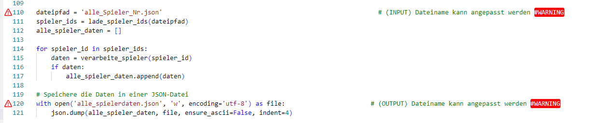

# Aufbau Geodateninfrastruktur (GDI)

Eine vollständige Geodateninfrastruktur (GDI) besteht aus dem Backend, dem Frontend und den verwendeted Libraries und API Schnittstellen. Das folgende Schema zeigt die aufgebaute und verwendete Geodateninfrasturktur der FootballMap auf.

## Backend

Das Backend beinhaltet alle unsichtbaren Inhalte und Daten, die sich auf dem Server (bei uns Raspberry Pi) befinden. Dazu zählt auch der Bezug von Geodaten und weiteren Daten über API-Schnittstellen oder mittels Web-Scraping. Das konzipierte Datenbankschema (siehe Bild unten) wurde mit postgres und postgis erstellt und die Daten wurden mittels Python-Skripts in die Datenbank eingepflegt. Der Geoserver ist das Bindeglied und der Bereitsteller der Datenbank. Mit Java Script React wird über den Geoserver auf die Daten zugegriffen und schlussendlich im Frontend dargestellt.

### Grundlagedaten

Um die erwähnten Funktionen der FootballMap umsetzten zu können, werden Fussballdaten benötigt. Ligen, Vereine, Stadien, Spieler und deren Transfers sollen in Form von strukturierten Daten erfasst und gespeichert werden. Transfermarkt.ch bietet seit 2001 eine Webseite mit umfassenden Daten rund um den Sport Fussball an. Die Grundlagedaten für die FootballMap beruhen deshalb auf Daten von Transfermarkt.ch. Alle Grundlagedaten wurden wie folgend beschrieben, erfasst und in der Datenbank abgespeichert. Die Datenbank liegt als SQL Dump im Ordner `preprocessing/Database/db_footballmap_v4_database-dump.sql` zur Verfügung und dient als Grundlage für die FootballMap. Somit müssen keine Daten erhoben werden. Um weitere Ligen, Vereine und Spieler zu integrieren können die folgenden Schritte durchgeführt werden, um weitere Daten zu erhalten und diese Daten in die Datenbank zu importieren. Die Skripts sind jeweils mit Notizen ("#WARNING") versehen, die dem Benutzer einen Hinweis geben, ob zum Beispiel ein Dateiname angepasst werden muss.

In den folgenden Unterkapitel werden die Abläufe und Python-Skripts der Datenerhebung beschrieben. Die folgende Visualisierung zeigt den Vorgang der Datenerhebung und die Weiterverarbeitung auf. Die weiteren Schritte für die Integration in die Datenbank werden [hier](#datenbank) beschrieben. Die Buchstaben A bis D finden sich in den folgenden Kapiteln wieder, in denen die einzelnen Datenerhebungen beschrieben werden.

#### A - Datenabfrage über API-Schnittstelle

(nicht mehr verfügbar / zukünftige Datenintegration kann mit Web-Scraping Lösungen durchgeführt werden)

Die Daten von Transfermarkt.ch konnten bis am 31. März 2024 über die API-Schnittstelle [Transfermarkt-API](https://transfermarkt-api.vercel.app/) bezogen werden. Liga-, Vereins- und Spielerdaten konnten über folgende Abfragen gefiltert und angezeigt werden. Der Zugang zu dieser API wurde nach dem 31. März 2024 geschlossen. Die Daten zu den Ligen, Vereinen und Stadien sind die Grundlage zur Darstellung der Club Logos auf der Startseite der FootballMap. Ausserdem werden diese Daten auch für die weiteren Funktionen [Squad Overview](#squad-overview) und [Transfer History](#transfer-history) benötigt.

***Beispielabfragen:***

- Suche eines Wettbewerbs (Liga):
  `https://transfermarkt-api.vercel.app/competitions/search/Super%20League`

- Abfrage Vereine eines Wettbewerbs:
  `https://transfermarkt-api.vercel.app/competitions/{Wettbewerbs_ID}/clubs`

- Abfrage Daten eines Vereins:
  `https://transfermarkt-api.vercel.app/clubs/{Club_ID}/profile`

- Abfrage Spieler eines Vereins:
  `https://transfermarkt-api.vercel.app/clubs/{Club_ID}/players`

- Abfrage Spielerprofil:
  `https://transfermarkt-api.vercel.app/players/{Spieler_ID}/profile`

- Abfrage Transfers eines Spielers:
  `https://transfermarkt-api.vercel.app/players/{Spieler_ID}/transfers`

***Ablauf der Datenabfrage mit bestehenden Skripts:***

Die Liga- und Vereinsdaten der FootballMap-Datenbank wurden über die Transfermarkt-API bezogen. Im Repository-Ordner (preprocessing/TransfermarktAPI_requests) befinden sich die Python-Skripts zur Abfrage und Speicherung der Daten. Es werden die Libraries [requests](https://pypi.org/project/requests/), [json](https://docs.python.org/3/library/json.html), [csv](https://docs.python.org/3/library/csv.html) und [pycopg2](https://pypi.org/project/psycopg2/) verwendet.

- `01_TM-API_AlleLigen_2_Liste_club_ids.py`
  - ***Grundlagedatei:*** JSON der Ligen `AlleLigen_formatiert.json` jeweils mit dem Attribut Liga_nr
  - ***Zieldatei:*** Liste mit allen Club Nummern (Club_nr) aus jeder Liga (Liga_nr)
  - Es wurden die relevantesten Fussballländer in Europa mittels [UEFA Ranking](https://www.uefa.com/nationalassociations/uefarankings/country/?year=2024) ausgewählt
  - Von den besten fünf Ländern wurden jeweils die obersten drei Ligen ausgewählt, bei den weiteren 15 Ländern jeweils die obersten zwei Ligen, von weiteren 18 Ländern jeweils die oberste Liga
  - In der Schweiz wurden die obersten fünf Ligen mit einbezogen

- `02_TM-API_Liste_club_nr_2_JSON.py`
  - ***Grundlagedatei:*** Liste mit Club Nummern (Club_nr)
  - ***Zieldatei:*** JSON mit Club Informationen
  - Jeder Club wird abgefragt, um ein Clubprofil mit Attributen wie Clubname, Stadionname und Adresse zu erstellen

Im File 02 wird pro Club das Clubprofil abgerufen und die jeweiligen Attribute wie Clubname, Stadionname, Adresse werden abgefragt. Die Adresse und der Stadionname werden als Parameter einer Abfrage der [Nominatim API](https://nominatim.org/release-docs/develop/api/Search/) hinzugefügt. Die Nominatim API von Open Street Map lokalisiert die Stadien und die passenden Koordinaten werden im Clubprofil gespeichert. Falls mit den Parametern (Stadt, Stadionname und Typ="stadium") kein Eintrag gefunden wird, wird das Attribut Stadium_Coordinates mit dem Wert "None" abgefüllt. Die folgenden drei Python-Skripts verwenden andere Parameter, um einen passenden Eintrag zum jeweiligen Stadionnamen zu finden.

- `03_Koord_request_Nominatim_v1.py`
  - ***Parameter:*** Stadionname und Typ="stadium"
  - ***Zieldatei:*** JSON mit erneuerten Club Informationen

- `04_Koord_request_Nominatim_v2.py`
  - ***Parameter:*** Clubname und Typ="stadium"
  - ***Zieldatei:*** JSON mit erneuerten Club Informationen

- `05_Koord_request_Nominatim_v3.py`
  - ***Parameter:*** Stadtname und Country="country"
  - ***Zieldatei:*** JSON mit erneuerten Club Informationen

Falls bei der zweiten Abfrage keine Koordinaten gefunden werden, werden in der dritten Abfrage die Koordinaten der zugehörigen Stadt im Clubprofil gespeichert.
Die finalisierten Clubprofile werden entweder in eine CSV-Datei oder in eine JSON-Datei umgewandelt oder formatiert. Je nach weiterem Anwendungswunsch, kann zwischen CSV und JSON gewählt werden. Für den Import der Daten in die Datenbank wird ein weiteres Skript
`preprocessing/TransfermarktAPI_requests/07_Clubs_json2pg.py` verwendet.

- `06_Clubs_json_2_csv.py`
  - ***Grundlagedatei:*** JSON mit Clubprofilen inklusive Koordinaten `AlleLigenAlleClubs.json` aus Skript 05
  - ***Zieldatei:*** CSV mit Clubprofilen

- `06_Clubs_json_2_json_formatiert.py`
  - ***Grundlagedatei:*** JSON mit Clubprofilen inklusive Koordinaten `AlleLigenAlleClubs.json` aus Skript 05
  - ***Zieldatei:*** JSON mit Clubprofilen formatiert

- `07_Clubs_json_2_pg.py`
  - ***Grundlagedatei:*** JSON mit Clubprofilen inklusive Koordinaten `AlleLigenAlleClubs_formatiert.json` aus Skript 06
  - ***Ziel:*** Daten in Datenbank

Alle Spieler Nummern (Spieler_nr) von Spielern in der Schweizer Super League wurden mit der [Transfermarkt-API](https://transfermarkt-api.vercel.app/) abgefragt und gespeichert. Diese Liste dient als Grundlage für das Web-Scraping der Spielerdaten und der Transferdaten.

- `10_TM-API_AlleSpieler_CH_SuperLeague.py`
  - ***Grundlagedatei:*** Liste mit allen Club Nummern (Club_nr) `preprocessing/Scrape_players/Alle_Spieler_Nr.json`
  - ***Ziel:*** JSON mit allen Spielern der angegebenen Club Nummern (club_nr)
  - Es wurden alle Spieler der Schweizer Super League in der Datenbank der FootballMap integriert. Die wirklich genutzten Spielerdaten stammen jedoch aus dem Teil:[Web-Scraping Sqad Overview](#web-scraping-squad-overview)

#### B - Web-Scraping aktuelle Liga Tabelle
(optional, für zukünftige Datenintegration)

Ziel ist es, die aktuelle Tabelle der Schweizer Superleague mit einem [Web-Scraping](https://www.ionos.de/digitalguide/websites/web-entwicklung/was-ist-web-scraping/) zu erhalten, da diese Daten nicht mit der [Transfermarkt-API](https://transfermarkt-api.vercel.app/) bezogen werden konnten. Es sollen die Attribute Rang, Club, Anz. Spiele, gewonnen, verloren, unentschieden, Anz. Tore, Gegentore und die Anzahl Punkte als Attribute von [Transfermarkt](https://www.transfermarkt.ch) bezogen werden. Um die Daten zu beziehen, wurde ein Python-Skript verwendet, welches nachffolgend aufgelistet ist.

- `01_scrape_table.py`
  - **Abfrage-URL:** `https://www.transfermarkt.ch/super-league/tabelle/wettbewerb/C1/saison_id/2023`
  - **Ziel:** JSON mit der aktuellen Tabelle

Das Skript verwendet die Python-Bibliotheken [requests](https://pypi.org/project/requests/) und [BeautifulSoup]( https://beautiful-soup-4.readthedocs.io/en/latest/), um Daten von der Webseite Transfermarkt zu extrahieren, die es anschliessend in einer JSON-Datei speichert.
Jedoch wurde dieses Skript nicht mehr weiter verwendet (siehe Kapitel Mockup)

#### C - Web-Scraping Squad Overview

(optional, für zukünftige Datenintegration)

Das Ziel der Seite Squad Overview ist es, alle Spieler eines ausgewählten Vereins anzuzeigen. Von den Spielern sollten mehrere Informationen in einer Tabelle angezeigt werden, wie die Nationalität, Position, Trikotnummer, starker Fuss und Geburtsdatum. Die geforderten Informationen können nicht mehr über die API-Schnittstelle bezogen werden. Als Alternative wird die Technik [Web-Scraping](https://www.ionos.de/digitalguide/websites/web-entwicklung/was-ist-web-scraping/) angewendet. Es werden Daten von Webseiten über den HTML Code und den CSS-Klassen identifiziert und strukturiert abgespeichert. Für die Spielerdaten der FootballMap wurden die Inhalte von Transfermarkt.ch verwendet. Somit können die bestehenden Daten und die bereits verwendeten ID's von Transfermarkt.ch (Spieler_nr) weiterverwendet werden.

Um die oben beschriebenen Daten aus der Webseite zu extrahieren werden die Libraries [beautifulsoup](https://beautiful-soup-4.readthedocs.io/en/latest/), [requests](https://pypi.org/project/requests/) und [json](https://docs.python.org/3/library/json.html) verwendet.

- `01_scrape_playerdata.py`
  - ***Grundlagedatei:*** JSON mit allen Spielernummern (Spieler_nr)
  - ***Ziel:*** JSON mit Spielerprofilen. Attribute: "spieler_nr", "trikotnummer", "name", "geburtsort","geburtsland", "vereinsbeitritt", "vertragsende", "position", "starker_fuss", "geburtsdatum", "körpergrösse","nationalität", "marktwert", "vereinsnummer", "spielerbild_link"

Mit den Funktionen von [requests](https://pypi.org/project/requests/) wird pro Spieler die URL mit der Spieler_nr aufgerufen. ***Abfrage-URL:*** `https://www.transfermarkt.ch/spielername/profil/spieler/{Spieler_nr}`. Die Antwort der URL Abfrage wird mit [beautifulsoup](https://beautiful-soup-4.readthedocs.io/en/latest/) umgewandelt, sodass Daten aus den einzelnen HTML Elementen extrahiert werden können.

#### D - Web-Scraping Transfer History

(optional, für zukünftige Datenintegration)

Für die Seite `Transfer History` werden die Transferdaten jedes Spielers von der spezifischen ***Abfrage-URL:*** `https://www.transfermarkt.ch/spielername/transfers/spieler/{Spieler_nr}` extrahiert. Die Standardabfrage mittels [BeautifulSoup](https://beautiful-soup-4.readthedocs.io/en/latest/) stösst jedoch aufgrund eines speziellen HTML-Elements (`<tm-transfer-history player-id="{spieler_nr}"></tm-transfer-history>`) auf Herausforderungen. Das HTML-Element `<tm-transfer-history>` . Daher wird für das Web-Scraping eine Kombination aus [Selenium](https://selenium-python.readthedocs.io/) und [BeautifulSoup](https://beautiful-soup-4.readthedocs.io/en/latest/) verwendet.

Der Web-Scraping-Prozess erfolgt durch ein [Jupyter Notebook](https://docs.jupyter.org/en/latest/) und nutzt Funktionen der Libraries [Selenium](https://selenium-python.readthedocs.io/) und [BeautifulSoup](https://beautiful-soup-4.readthedocs.io/en/latest/):

- ***Notebook:*** `01_Transfermarkt_Transferdata_Notebook.ipynb`
  - ***Ausgangsdatei:*** Liste der Spielernummern (Spieler_nr)
  - ***Ziel:*** CSV mit einer Zeile pro Transfer, die Attribute wie Spieler-Nr., Saison, Datum, abgebender Verein, Name des alten Clubs, aufnehmender Verein, Name des neuen Clubs, Marktwert und Ablösesumme enthält.

Mit Selenium wird ein automatisierter Webdriver betrieben, der durch das Jupyter Notebook gesteuert wird. Es navigiert zur spezifischen Abfrage-URL, integriert eine Wartezeit und akzeptiert die Cookies. Die Datenextraktion erfolgt erneut über BeautifulSoup, wobei die Attribute jeder Tabellenzeile gesichert werden.

Die Attribute für das Ursprungs- und Zielland der Clubs (`old_club_country` und `new_club_country`) wurden manuell zu jedem Transfer hinzugefügt, da diese nicht direkt aus der Tabelle entnommen werden konnten. Eine Erweiterung des Jupyter Notebooks könnte eine verbesserte Navigation einschliessen, um diese Informationen automatisch aus den Clubseiten auf [Transfermarkt](https://www.transfermarkt.ch/{Vereinsname}/stadion/verein/{Club_nr}/saison_id/2023) zu ziehen. Ein weiterer Ansatz, das Land des Clubs mittels der [Nominatim API](https://nominatim.org/release-docs/develop/api/Search/) zu ermitteln, schlug fehl, da nur für etwa 10% der Clubs entsprechende Einträge gefunden wurden. Diese Verknüpfung des Landes mit dem Club ist in der Datenbank vorhanden, jedoch sind nicht alle globalen Vereine in der FootballMap-Datenbank erfasst, was bei der Darstellung der Transferhistorie zu Datenlücken führen kann.

### Datenbank

#### Datenbankschema

Das Datenbankschema wurde möglichst auf die vorhandenen Daten und auf die Nutzung der Daten abgestimmt. Nicht alles ist Datenbank-technisch optimal umgesetzt, da z.B. Redundanzen in den Daten vorhanden sind. Ausserdem gibt es fehlende Beziehungen, die technisch zwar möglich sind, aber bei der Erfassung der Daten zu vielen Problemen führten. Diese wurden bewusst nicht definiert.

Die Datenbank "footballmap" wurde technisch in postgresql / postgis umgesetzt. Es wurden folgende Entitäten (Tabellen) definiert. Die wichtigsten Inhalte sind in den Klammern aufgelistet.
- land (Ländergrenzen, Flaggen, etc.)
- stadium (Standort, Kapazität und Name der Fussballstadien)
- liga (Name und Land der Ligen)
- club (Name, Land und Logo der Fussball-Clubs)
- spieler (Informationen wie Name, Geburtsdatum, etc. zu den Fussballspielern)
- transfer (Fussballtransfers von Club nach Club)

Die detaillierten Attribute sind im nachfolgenden Datenbankschema abgebildet:

Die dazugehörige SQL-Definition ist im `preprocessing/Database/db_footballmap_v4.sql` einzusehen.
Für die Integration des Datenbankschemas und den Daten muss folgende Datei verwendet werden: `preprocessing/Database/db_footballmap_v4_database-dump.sql`

Als Primärschlüssel (PK) wurde jeweils eine automatisch aufnummerierte ID vergeben. Als Verknüpfungsattribut (FK) wurde jedoch die offiziell von Transfermarkt verwendete Nummer in die Datenbank eingeführt. Die jeweiligen Schlüsselattribute sind mit _id bzw. _nr gekennzeichnet.

Es ist zu erwähnen, dass die Position der Stadien als geographische Koordinaten (lat / lon) erfasst sind und nicht als Punktgeometrien.

Die einzigen Geometrien in der sogenannten Geodatenbank sind in der Tabelle "land" mit den Ländergrenzen (multipolygon) und den Zentren der Ländern (point) enthalten.

#### Tabelle land und Abfrage von Länder-Flaggen

Die Tabelle "land" enthält die Grundlagedaten der Länder, welche zum einten als Hintergrundkarte bei Player Origin wie auch teilweise für die Darstellung von Transferlinien verwendet wird.

Aus Fussball-Technischen Gründen wurde Grossbritannien in die Länder England, Schottland, Wales und Nordirland aufgeteilt. Ansonsten wurden die Länder-Grenzen unverändert von [Natural Earth](https://www.naturalearthdata.com/) übernommen und in die Datenbank importiert. Für politische Ungereimtheiten bei den Landesgrenzen wird keine Verantwortung übernommen. Die Tabelle "land" wurde mit den ISO 3166-Ländercodes erweitert, welche als Identifikation für die Abfrage der Länder-Flaggen verwendet wurde. Die Flaggen wurden von einer [API]("https://www.welt-flaggen.de/herunterladen/api") bezogen. Der Import in die Datenbank wurde mit dem File "preprocessing/Database/flag2db.ipynb" grösstenteils mittels Python erledigt. Die Flaggen wurden als Binär-Bild, als online-Link und als lokalen Pfad in die Datenbank abgespeichert.

Die Tabelle "land" weist technisch keine Beziehung zu den anderen Tabellen auf, was aus Datenbank-technischer Sicht nicht optimal ist. Jedoch wurde dies so umgesetzt, da die Importe der extrahierten Daten ansonsten infolge Fremdschlüssel-Bedingungen zu vielen Problemen führten, da die Schreibweise der Länder oft unterschiedlich war. Bei für die Abfragen entscheidenden Attributen wie das Geburtsland oder die Nationalität der Spieler wurde darauf geachtet, dass die Schreibweise der Fussballdaten mit den Namen in der Tabelle "land" übereinstimmen. Dies musste manuell korrigiert werden. Bei Attributen, wo das Land lediglich als Information für den User genutzt wird, wurde die Schreibweise der Länder von den extrahierten Daten unverändert übernommen. Grundsätzlich wurde jedoch die Englische Schreibweise der Länder-Namen verwendet.

#### Import Fussballdaten in die Datenbank

Die Daten aus dem Scraping entstandenen Zieldateien (.json) wurden in die Datenbank importiert. Als Schnittstelle wurde das File "preprocessing/Database/json2db.ipynb" verwendet, welches grösstenteils die Daten mittels Python direkt in die Datenbank schreibt. Das File ist Schrittweise aufgebaut und erlaubt dem Benutzer, die Daten Schritt für Schritt in der Datenbank entweder gesamthaft oder nach einzelnen Tabellen zu aktualisieren. Dabei ist zu erwähnen, dass die gescrapten Daten teilweise unenheitlich und schlecht strukturiert waren. Einige Spezialfälle wurden bereits abgedeckt, jedoch tauchten bei jeder Aktualisierung wieder neue Probleme auf, die eine vollständige Automatisierung verunmöglichte. Beispielsweise wurde der Marktwert als "600 Tsd." extrahiert, diese Art von Zahlen mussten in eine numerische Zahl (600000) umgewandelt werden. Ein weiteres Beispiel stellen die extrahierten Zeitstempel dar. Diese mussten von der Form "Dec 31, 1998" nach "31.12.1998" umgewandelt werden.

Alle Bilddateien (Spielerbilder und Club-Logos) wurden, wie die Flaggen bei der Tabelle "land", als Binär-Bild, als online-Link und als lokalen Pfad in der Datenbank erfasst.

#### Datenbankabfragen (DB-Views)

Insgesamt wurden 4 DB-Views definiert, welche als Schnittstelle zwischen den Daten in den Datentabellen und dem Frontend dienen werden:
- vw_club_all
- vw_spielerdaten
- vw_spieler_geburtsland
- vw_transferlinien

Die DB-Views dienen zum einen für die Abfrage und die Filterung von Daten aus mehreren Tabellen und zum anderen für die Erstellung von Geometrien mittels Postgis-Befehlen. Mittels Postgis-Befehl "ST_MakePoint" werden die Standorte der Stadien im View "vw_club_all" von lat/lon in eine Geometrie (point) umgewandelt.

Die Transferlinien werden als Geometrie (line) mittels Postgis-Befehlen "ST_MakePoint" und "ST_MakeLine" im View "vw_transferlinien" gezeichnet. Es werden grundsätzlich die Linien zwischen den Club-Positionen "von_club" nach "nach_club" definiert. Sind die Clubs jedoch "unbekannt" (Nummer 999999), dann werden als Ersatz die Zentren der Länder verwendet. Weiter werden Transferlinien mit der Länge von 0 weggefiltert. Dies ist der Fall, wenn ein Spieler von einem unbekannten zu einem anderen unbekannten Club innerhalb des gleichen Landes wechselt. In den meisten Fällen betrifft dies den Wechsel innerhalb Jugendmannschaften (z.B. Sparta Praha U18 nach Sparta Praha U19). Diese Transfers sollen bewusst nicht dargestellt werden.

### Geoserver

Die 4 oben beschriebenen DB-View wurden mittels Geoserver freigegeben.

## Frontend

Die Kombination folgender Technologien ermöglicht es für die FootballMap, eine robuste und interaktive Webanwendung zu erstellen. [React](https://react.dev/) wird genutzt, um die Benutzeroberfläche aufzubauen und zu steuern, während npm dabei hilft, alle notwendigen Pakete und Abhängigkeiten zu verwalten. [OpenLayers](https://openlayers.org/) bindet die Kartendaten ein und bietet die Funktionalität für interaktive Kartennavigation an.

### React

[React](https://react.dev/) ist eine leistungsstarke JavaScript-Bibliothek zur Erstellung von Benutzeroberflächen, entwickelt von Facebook. Sie ermöglicht es Entwicklern, wiederverwendbare UI-Komponenten zu erstellen, die den Zustand der Anwendung effizient verwalten können. [React](https://react.dev/) wird verwendet, um eine reaktive, benutzerfreundliche Oberfläche zu schaffen, die sich dynamisch an die Interaktionen des Benutzers anpasst. Diese Vorteile von [React](https://react.dev/) wurden ausgenutzt.

Es wird die Bibliothek [Axios](https://axios-http.com/docs/intro) genutzt, um auf Daten von externen Quellen wie dem Geoserver via HTTP-Anfragen zuzugreifen. [Axios](https://axios-http.com/docs/intro) ermöglicht es, asynchrone HTTP-Requests zu senden und zu empfangen,

### Node package manager (npm)

npm erleichtert das Installieren, Aktualisieren und Verwalten von Softwarepaketen, die für die Entwicklung des Frontends, einschliesslich [React](https://react.dev/) und [OpenLayers](https://openlayers.org/), benötigt werden. npm verwaltet Abhängigkeiten für Node.js-Anwendungen.

### Open Layers

[OpenLayers](https://openlayers.org/) wird eingesetzt, um die geografischen Daten in einer interaktiven Karte darzustellen, die Benutzerinteraktionen wie Zoomen, Verschieben und Klicken auf Elemente unterstützt. [OpenLayers](https://openlayers.org/) kann über seine umfangreichen Quellenoptionen direkt auf den Geoserver zugreifen, um räumliche Daten zu laden und anzuzeigen. Durch die Verwendung von WMS (Web Map Service) oder WFS (Web Feature Service), ermöglicht [OpenLayers](https://openlayers.org/) das Abrufen der bereitgestellten Geodaten auf dem Geoserver. Explizit wurden aus der Datenbank mehrere Views erstellt, welche auf dem Geoserver abgelegt sind. Genau auf diese Views wird via [Axios](https://axios-http.com/docs/intro) auf die Daten zugegriffen, die über diese Views zur Verfügung gestellt werden. Für die Seite Transfer History werden beispielsweise die jeweiligen Transferlinien des gewählten Spielers über den View auf dem Geoserver abgefragt und mittels Open Layers dargestellt. Mit den Methoden getSource und getFeatures werden die einzelnen Linien identifiziert.

### UI Design

Das [User Interface (UI)](https://www.unic.com/de/magazin/was-ist-user-experience-ux-was-user-interface-ui) Design konzentriert sich darauf, wie die Website optisch gestaltet ist und wie die Benutzerelemente angeordnet sind. Für die Footballmap wurde ein minimales Design gewählt, das durch die Verwendung von dynamischen Karten und interaktiven Geodaten ergänzt wird. Die visuelle Darstellung auf der Startseite und in den verschiedenen Funktionsbereichen wie "Squad Overview" und "Transfer History" verwendet eine Kombination aus Icons, Menüleisten und interaktiven Karten, die intuitiv und leicht zugänglich sind. Farben und Schriftarten sind so gewählt, dass sie Lesbarkeit verbessern und die Hierarchie der Funktionen erkennbar ist. Das minimale Design erleichtert das Lesen von Information und regt an die verschiedenen Ligen, Vereine, Spieler und deren Transferhistorie zu erkunden. Die Menubar inklusive Dropdowns wurde mit [MUI-Material](https://mui.com/) erstellt. Alle restlichen Komponenten wurden manuell in [HTML](https://de.wikipedia.org/wiki/Hypertext_Markup_Language) erstell und mit [CSS](https://de.wikipedia.org/wiki/Cascading_Style_Sheets) gestylt.

### UX Design

Das [User Experience (UX)](https://www.unic.com/de/magazin/was-ist-user-experience-ux-was-user-interface-ui) Design der Footballmap zielt darauf ab, eine nahtlose Nutzererfahrung zu schaffen. Dies wird durch die geplante Benutzerführung versucht, die es den Nutzenden ermöglicht, schnell und effizient durch die verschiedenen Funktionen der Plattform zu navigieren. Die interaktiven Elemente, wie das Klicken auf Clublogos, um die weiteren Funktionen zu einem Club oder Spieler zu erhalten, sind möglichst logisch gestaltet. Der Übergang zwischen den einzelnen Seiten und Funktionen ist über einen Klick möglich, wodurch die Nutzer engagiert bleiben und leicht verstehen können, wie sie die benötigten Informationen abrufen können. Die Hauptfunktionen mit der meisten Benutzung sind die Dropdown-Elemente im Headerbereich. Alle Buttons wurden im gleichen Stil verwaltet. Das Highliten der Buttons und der Tabelleneinträge bei einem Mouse-Hover und die Änderung der Cursordarstellung vermittelt den Nutzenden, dass eine Funktion an dieser Stelle aufgerufen wird. Ausserdem verstärkt das Farbdesign mit einer dunkeln Grundfarbe (dunkelblau) und zwei kontrastreichen Ergänzugsfarben (weiss/gelb) die einzelnen Hervorhebungen und Buttons. Die Dropdown-Elemente werden mit einer Überschrift beschrieben. Die Überschriften verdeutlichen den Nutzenden, was mit diesem Dropdown ausgewählt werden kann. Alle User-Interaktionen sind durch Hover-Styling und Cursor-Styling klar verständlich. Alle beschriebenen Funktionen und Interaktionen wurden bei einem Nutzertest mit einem Umfang von 8 Personen getestet. Die Nutzenden wurden beobachtet und die Fehlinteraktionen wurden notiert. Einige nicht implementierte Funktionen wurden von den Testpersonen erwartet, die im Kapitel [Erweiterungsmöglichkeiten](ausblick.md#erweiterungsmöglickeiten) beschrieben werden. Die möglichen Fehlinteraktionen wurden so weit wie möglich minimiert.

[↑](#top)

  

    <a href="funktionen.html">← Erklärung der Funktionen</a>
  

  

    <a href="konzept.html">Konzept und Ideen →</a>
  

