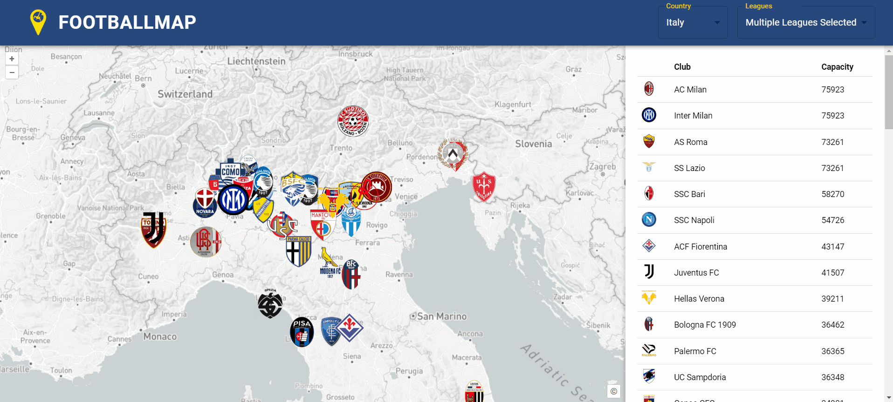

# Erweiterungsmöglichkeiten

Im folgenden Abschnitt werden für jede Seite und Funktion Verbesserungs- und Erweiterungsvorschläge genannt, welche Vorteile für die User Experience (User Erfahrung) bieten oder die Funktionen der FootballMap erweitern. Die Ideen sind der Wichtigkeit nach geordnet (von oben nach unten).

### Allgemein

Für die Kartenelemente sind folgende Funktionen für zukünftige Versionen angedacht und sinnvoll:
  - Map Control: Button "Extend to selected Features", Ausdehnung der Karte auf ausgewählte Daten anpassen
  - Hintergrundkarte: Eine Hintergrundkarte mit eigenem Stil (gemäss Gestaltungskonzept FootballMap). Die Umsetzung einer solchen Hintergrundkarte ist mit [MapBox](https://docs.mapbox.com/api/maps/styles/) möglich.
  - ***Frontend:*** Weitere Länder und Ligen in den Dropdowns zur Verfügung stellen.
    ***Umsetzung Backend:*** Weitere Daten mit der Web-Scraping Methode wie in [Web-Scraping Transfer History](aufbauGDI.md#web-scraping-transfer-history) extrahieren und speichern. [Selenium](https://selenium-python.readthedocs.io/) und [BeautifulSoup](https://beautiful-soup-4.readthedocs.io/en/latest/). Die zusätzlichen Daten können problemlos in die bestehende Datenbank und Geodateninfrastruktur eingepflegt werden. Es können bestehende Python-Skripts verwendet werden.
  - ***Backend:*** Datenüberprüfung, stimmen die Koordinaten der Vereine? -> Verfeinerung der [Koordinatenzuweisung](aufbauGDI.md#koordinatenzuweisung).

### Startpage

Für die [Startpage](funktionen.md#startpage) sind folgende Funktionen für zukünftige Versionen angedacht und sinnvoll:
  - Flackern der Logos beheben. Ab einer bestimmten Anzahl an angezeigten Logos beginnen die Logos zu flackern. Die Fehlerquelle wurde noch nicht gefunden.

  - Kollision der Logos vermeiden

  - Hintergrundkarte: Ergänzung Satellitenbild für die Erkundung der Stadien und deren Umgebung

### Squad Overview

Für die Seite [Squad Overview](funktionen.md#squad-overview) sind folgende Funktionen für zukünftige Versionen angedacht und sinnvoll:
  - Hintergrundkarte: Ergänzung Satellitenbild für die Erkundung der Stadien und deren Umgebung

### Transfer History

Für die Seite [Transfer History](funktionen.md#transfer-history) sind folgende Funktionen für zukünftige Versionen angedacht und sinnvoll:
  - Logos der Vereine an Start und Endpunkten der Transferlinien
  - Pfeile an Transferlinien, damit die Transferrichtung anhand der Linien identifiziert werden kann
  - Auswahl der Features per Klick und folgendes Highlight des Eintrages in der Tabelle
  - Marktwerte als Steuerung der Liniendicke verwenden -> Sichtbar bei welchem Transfer der Spieler den höchsten Marktwert hatte.
  - Randomisierung des Linienverlaufs (gekrümmte Linie oder geodätische Linie) -> wirkt spannender als die geraden Transferlinien
  - Erweiterung Karten: Mehrere Karten mit verschiedenen Ausschnitten und Zoom-Stufen. Es sollte auf den ersten Blick möglich sein alle Transfers zu erkennen. Die Notwendigkeit mehrerer Karten ist durch die bereits implementierten Funktion (Klick auf Eintrag in der Tabelle -> Zoom zur Transferlinie) gesunken.

### Player Origin

Für die Seite [Player Origin](funktionen.md#player-origin) sind folgende Funktionen für zukünftige Versionen angedacht und sinnvoll:
  - "Zoom to Country", Ausdehnung der Karte auf geklicktes Land anpassen
  - "Klick on Playercount or Country", Pop-up oder Anzeige der Spieler aus diesem Land.
  - Verwendung der Nationalität der Spieler und nicht das Geburtsland
  - ***Umsetzung Backend:*** Korrekte auswahl der Nationalität, falls zwei oder mehrere Nationalitäten pro Spieler vorkommen. Nach Erfahrung ist die als erstes gelistete Nationalität auch die Nation für die der Spieler in der Nationalmannschaft spielt.

[↑](#top)

  

    <a href="funktionen.html">← Konzept und Ideen</a>
  

  

   <a href="quellenverzeichnis.html">Quellenverzeichnis →</a>
  

