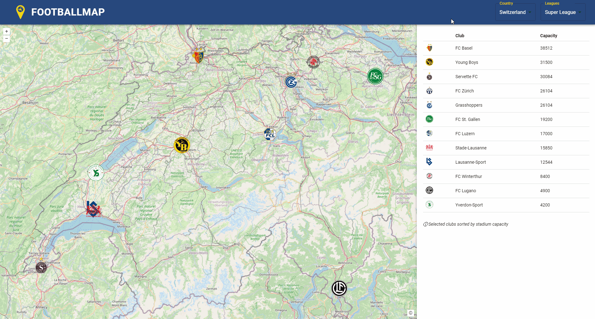
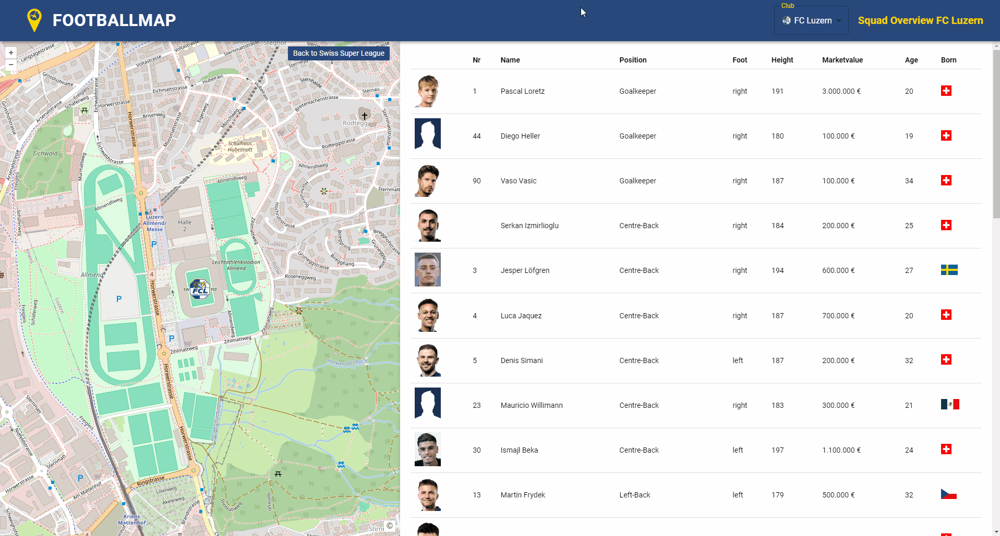
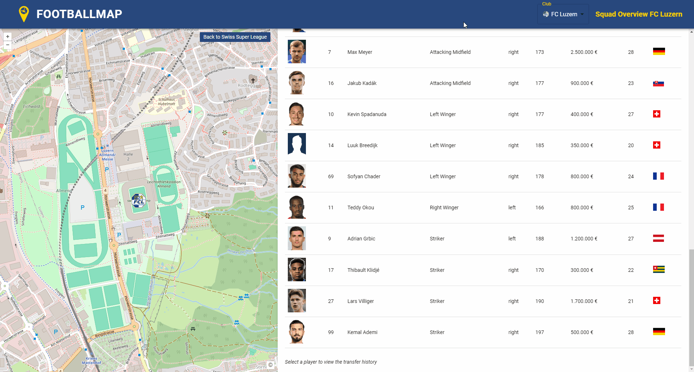
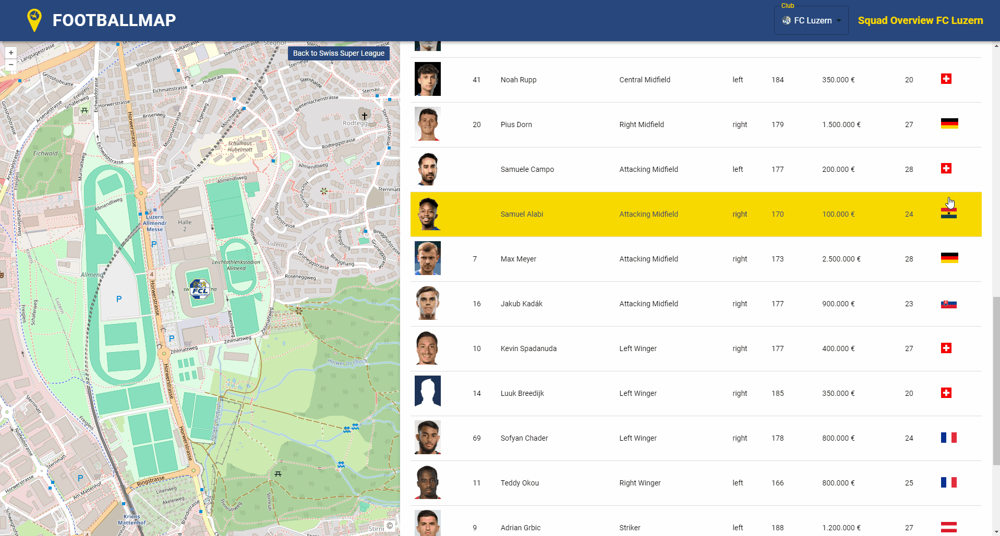
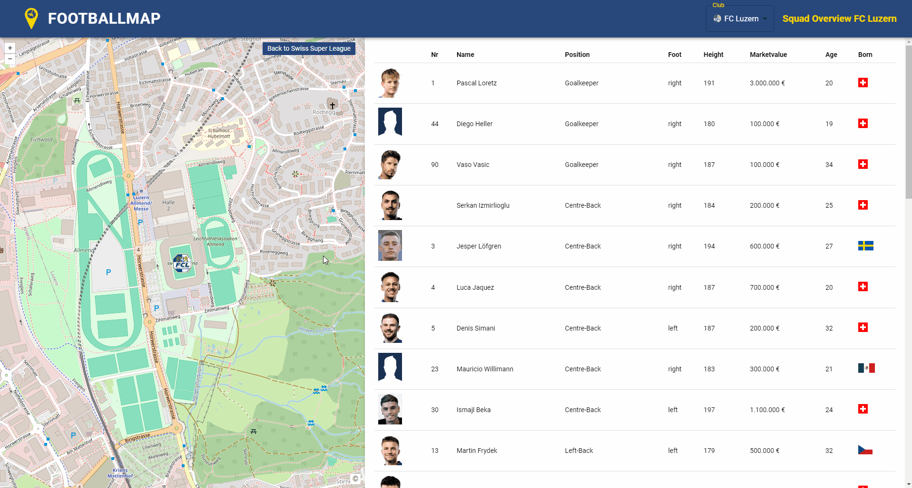
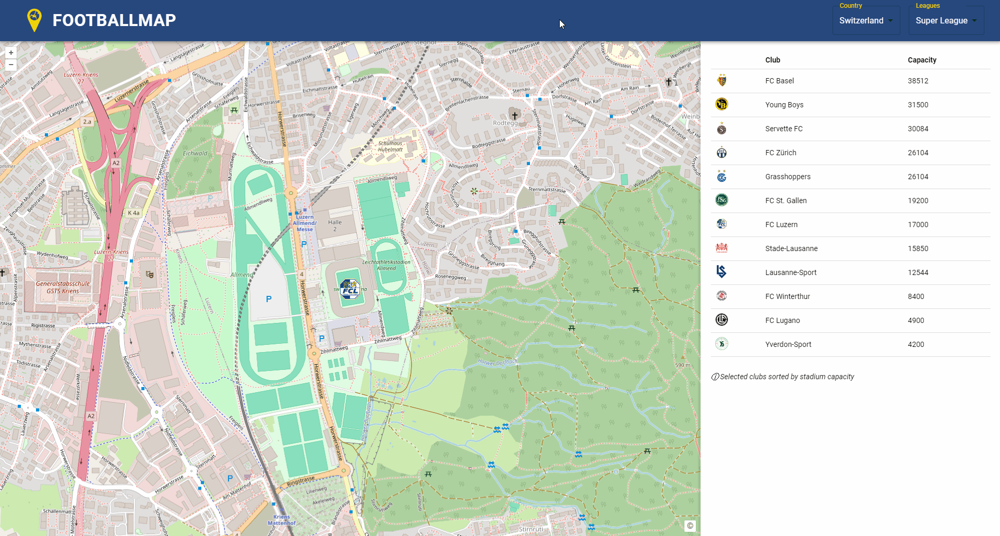
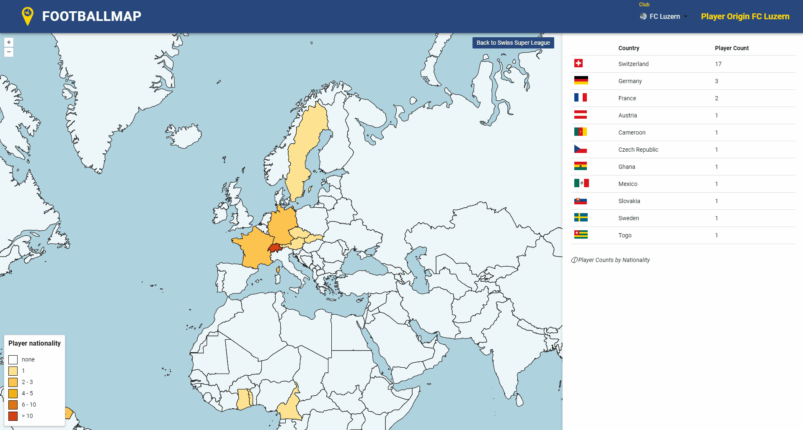
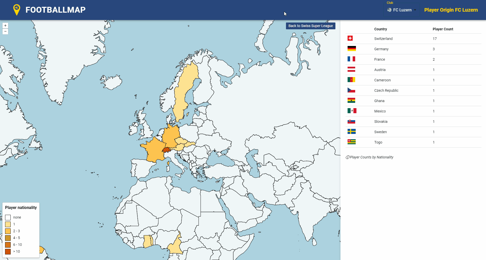

# Erklärung der Funktionen von Football Map

In diesem Abschnitt werden die Funktionen und Interaktionen der Football Map beschrieben.

## Startpage

Auf der Startseite erscheint eine dynamische Karte, die auf die Schweiz fokussiert ist. Es werden die Clublogos entsprechend iherer geografischen Lage (Stadion) angezeit. Über die Toolbar können die Nutzenden aus 30 Ländern und 70 Ligen Clubs auswählen und filtern. Insgesamt sind 1060 Clubs in der Datenbank vorhanden.

Die Anzahl der Ligen pro Land variiert je nach Spielstärke. Für führende Fussballnationen sind die drei obersten Ligen verfügbar. Bei Ländern mit mittlerem Fussballniveau wurden die zwei höchsten Ligen einbezogen. In anderen Nationen ist jeweils nur die oberste Liga vertreten. Für die Schweiz hingegen wurden die fünf höchsten Ligen aufgenommen. Die Gewichtung wurde aus der UEFA Rankingliste [UEFA Ranking](https://www.uefa.com/nationalassociations/uefarankings/country/?year=2024) entnommen.

### Funktionen:
- Mit Klick auf Clublogo wird der Stadiumname aufgerufen und es werden weitere Funktionen (Squad Overview und Player Origin) freigeschaltet.

- Tabelle aller Stadion innerhalb einer Liga geordnet nach Stadionkapazität

- Filtern nach Land 

- Filtern nach Land und Liga mit der Möglichkeit mehrere Ligen eines Landes einzublenden

## Squad Overview

Durch den entsprechenden Klick auf den Button Squadoverview, wie es im Kapitel Startpage beschrieben wurde, öffnet ein weiteres Fenster. In diesem Ausschnitt kann nun das entsprechende Kader betrachtet werden (siehe Bild). Insgesamt wurden 360 Spieler und 2880 Attribute (Spielerinformationen) aus der Schweizer Super League in der Datenbank erfasst.

### Funktionen:
- Durch den Klick auf Spieler ist eine weitere Funktion (Transfer History) aufrufbar
- Dynamische Karte mit Zoomfunktion auf Club
- Button, um zur Startseite zurückzukehren
- Tabelle mit Spielern des Clubs und Spielerinformationen (Shirt Nr., Name, Position, Foot, Height, Marketvalue, Age, Born)

- Ändern der Teamübersicht auf einen anderen Club mittels Auswahlmenü in der Toolbar

- Wenn der Mauszeiger über die Flagge des Herkunftslandes in der Tabelle bewegt wird, erscheint der Name des Landes.

Bemerkung: Diese Informationen und Funktionen sind nur für Clubs aus der schweizerischen Super League, sowie deren Spieler möglich.

## Transfer History

Mit dem Entsprechenden Klick auf den Spieler (Seite Squad Overview), geht eine neue Seite auf. Die Seite Transfer History ermöglicht es den Transferweg eines Spielers zu betrachten Die Stationen werden durch Linien dargestellt. Fehlt ein Club in der Datenbank bei einem Transfer, wird stattdessen das Land des Clubs mit seinem Zentroid als Station verwendet. In der vorhandenen Tabelle sind alle Transfers, sortiert nach Datum, aufgelistet.

### Funktionen:
- Unterteilung von Leihe und Transfer mittels unterschiedlicher Liniendarstellung inklunsive Lengende
-  Tabelle zur Darstellung der Transferhistorie, einschliesslich Details zu den beteiligten Vereinen (abgebender und aufnehmender Club), dem Datum des Transfers, dem Marktwert des Spielers sowie der Ablösesumme
- Klick auf Transfer in Tabelle markiert den Transferweg auf der Karte
- Klick auf Transferweg markiert Transfereintrag in Tablle
- Button um zurück zur Squad Overview zu gelangen

## Player Origin
Durch Klicken auf den Button „Player Origin“, wie im Kapitel „Startpage“ beschrieben, öffnet sich ein neues Fenster. Diese Seite bietet die Möglichkeit, die Herkunft eines Teams anhand einer thematischen Karte zu betrachten, die in geeignete Klassen unterteilt und mit einer passenden Legende versehen ist. Es ist dabei wichtig zu beachten, dass die Herkunft eines Spielers aufgrund seines Geburtslandes ermittelt wurde. Dieser Ansatz wurde gewählt, weil das Geburtsland ein eindeutiger Wert ist und die Angabe der Nationalität mehrere Einträge umfassen kann.

### Funktionen:
- Thematische Kartendarstellung zur Visualisierung der Spielerherkunft
- Tabelle, sortiert nach der Anzahl der Spieler aus jedem Herkunftsland
- Automatische Anzeige des Landnamens, wenn der Mauszeiger über ein Land bewegt wird

- Möglichkeit das Team zu wechseln

[Zurück nach oben](#top)