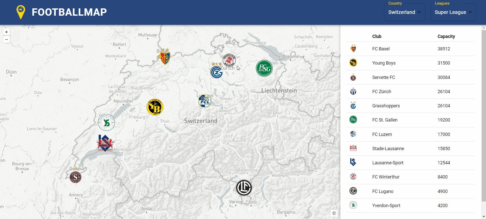
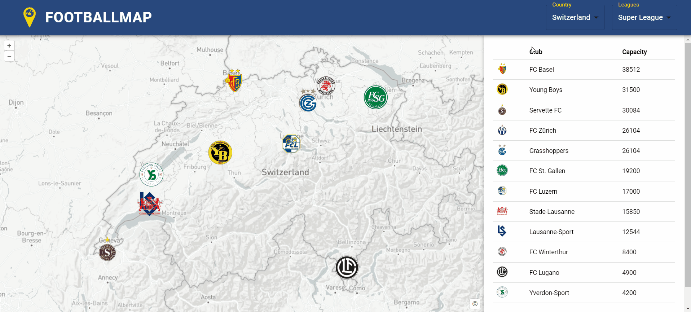
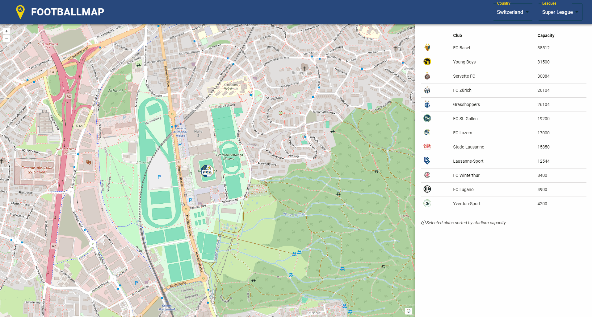

# Erklärung der Funktionen von Football Map

In diesem Abschnitt werden die Funktionen und Interaktionen der Football Map beschrieben.

## Startpage

Auf der Startseite erscheint eine dynamische Karte, die auf die Schweiz fokussiert ist. Es werden die Clublogos entsprechend ihrer geografischen Lage (Stadion) angezeigt. Über die Toolbar können die Nutzenden aus 30 Ländern und 70 Ligen, Clubs auswählen und filtern. Insgesamt sind 1060 Clubs in der Datenbank vorhanden.

Die Anzahl der Ligen pro Land variiert je nach Spielstärke. Für führende Fussballnationen sind die drei obersten Ligen verfügbar. Bei Ländern mit mittlerem Fussballniveau wurden die zwei höchsten Ligen einbezogen. In anderen Nationen ist jeweils nur die oberste Liga vertreten. Für die Schweiz hingegen wurden die fünf höchsten Ligen aufgenommen. Die Gewichtung wurde aus der UEFA Rankingliste [UEFA Ranking](https://www.uefa.com/nationalassociations/uefarankings/country/?year=2024) entnommen. Die folgende Tabelle zeigt die ersten zehn Länder und deren Anzahl Ligen, welche in der Datenbank integriert wurden.

| Land           | Anz. Ligen |
|----------------|------------|
| Schweiz        | 5          |
| Deutschland    | 3          |
| England        | 3          |
| Frankreich     | 3          |
| Italien        | 3          |
| Österreich     | 3          |
| Spanien        | 3          |
| Belgien        | 2          |
| Dänemark       | 2          |
| Griechenland   | 2          |

### Funktionen:
- Mit Klick auf Clublogo wird ein Popup mit Informationen zum Verein und Station aufgerufen und es werden die weiteren Funktionen (Squad Overview und Player Origin) mit Buttons im Popup freigeschaltet. Die Funktionen [Squad overview](#squad-overview) und [Player Origin](#player-origin) sind in den verlinkten Kapitel detailierter beschrieben.

- Auf der Startseite wird jeweils eine Tabelle aller Vereine aus der gewählten Liga angezeigt. (sortiert nach Stadionkapazität)

- Dropdownauswahl nach Land, wobei die Funktionen "Squad Overview" und "Player Origin" nur für die [Schweizer Super League](https://sfl.ch/de/de) freigeschaltet sind. Für die weiteren Ligen fehlen die Spielerdaten in der Datenbank.

- Dropdownauswahl nach Ligen, die in gewähltem Land verfügbar sind. Es besteht die Möglichkeit mehrere Ligen eines Landes einzublenden.

## Squad Overview

Durch den entsprechenden Klick auf den Button Squad Overview, öffnet sich eine weitere Seite. In diesem Ausschnitt kann nun das entsprechende Kader betrachtet werden. Insgesamt wurden 360 Spieler und 2880 Attribute (Spielerinformationen) aus der Schweizer Super League in der Datenbank erfasst.

### Funktionen:
- Durch den Klick auf Spieler ist eine weitere Funktion (Transfer History) aufrufbar
- Dynamische Karte mit Zoomfunktion auf den Club
- Button, um zur Startseite zurückzukehren
- Tabelle mit Spielern des Clubs und Spielerinformationen (Shirt Nr., Name, Position, Foot, Height, Marketvalue, Age, Born)

- Ändern der Teamübersicht auf einen anderen Club mittels Auswahlmenü in der Toolbar

- Wenn der Mauszeiger über die Flagge des Herkunftslandes in der Tabelle bewegt wird, erscheint der Name des Landes

Bemerkung: Die Spielerinformationen und Funktionen sind nur für Clubs aus der schweizerischen Super League, sowie deren Spieler möglich

## Transfer History

Mit dem Entsprechenden Klick auf den Spieler (Seite Squad Overview), geht eine neue Seite auf. Die Seite Transfer History ermöglicht es den Transferweg eines Spielers zu betrachten Die Stationen werden durch Linien dargestellt. Fehlt ein Club in der Datenbank bei einem Transfer, wird stattdessen das Land des Clubs mit seinem Zentrum (Zentroid) als Station verwendet. In der vorhandenen Tabelle sind alle Transfers, sortiert nach Datum, aufgelistet.

### Funktionen:
- Unterteilung von Leihe und Transfer mittels unterschiedlicher Liniendarstellung inklunsiv Lengende
-  Tabelle zur Darstellung der Transferhistorie, einschliesslich Details zu den beteiligten Vereinen (abgebender und aufnehmender Club), dem Datum des Transfers, dem Marktwert des Spielers sowie der Ablösesumme
- Klick auf Transfer in Tabelle markiert den Transferweg auf der Karte
- Klick auf Transferweg markiert Transfereintrag in Tablle
- Button um zurück zur Squad Overview zu gelangen

## Player Origin
Durch Klicken auf den Button „Player Origin“, wie im Kapitel „Startpage“ beschrieben, öffnet sich ein neues Fenster. Diese Seite bietet die Möglichkeit, die Herkunft eines Teams anhand einer thematischen Karte zu betrachten, die in geeignete Klassen unterteilt und mit einer passenden Legende versehen ist. Es ist dabei wichtig zu beachten, dass die Herkunft eines Spielers aufgrund seines Geburtslandes ermittelt wurde. Dieser Ansatz wurde gewählt, weil das Geburtsland ein eindeutiger Wert aufweist und die Nationalität mehrdeutig ist.

### Funktionen:
- Thematische Kartendarstellung zur Visualisierung der Spielerherkunft
- Tabelle, sortiert nach der Anzahl der Spieler aus jedem Herkunftsland
- Automatische Anzeige des Landnamens, wenn der Mauszeiger über ein Land bewegt wird

- Möglichkeit das Team zu wechseln

[↑](#top)

  

    <a href="einleitung.html">← Einleitung</a>
  

  

    <a href="aufbauGDI.html">Aufbau GDI →</a>
  

