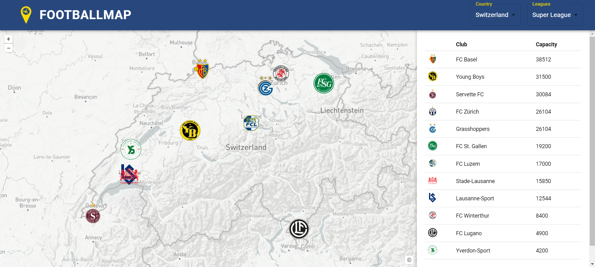

# GDI Projekt - Footballmap

Willkommen auf der GitHub-Page der Geodateninfarastruktur FootballMap. Hier findest du alles über die vorhandenen Funktionen und die Informationen zur Erarbeitung der WebApp.

GitHub Repository: [https://github.com/314a/GDI_Project](https://github.com/314a/GDI_Project)

### Ansicht der Startseite

#### Projektteam
- [Nando Amport](https://github.com/naamp)
- [Stefan Sidler](https://github.com/StefanSidler95)
- [Silvan Baumeler](https://github.com/SilvanBaumeler)

[↑](#top)

  

  

  

    <a href="einleitung.html">Konzept und Ideen →</a>
  

