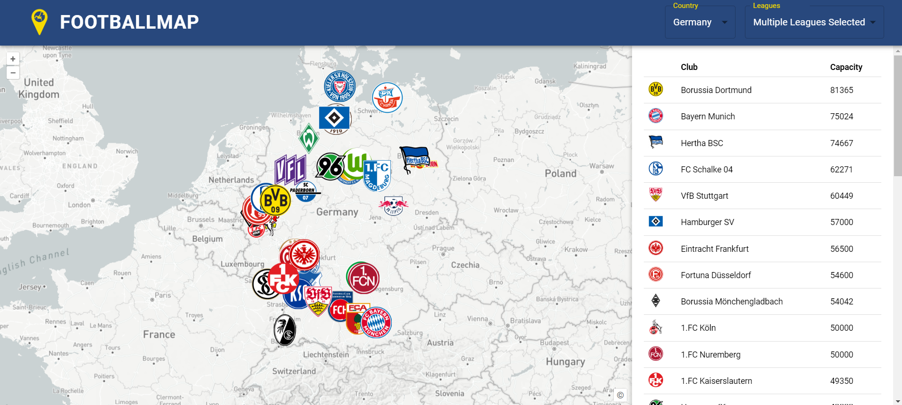
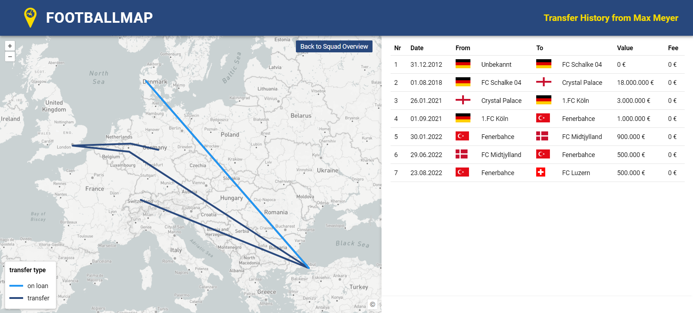

# GDI Projekt - Footballmap

[↑ Nach oben](#top)

Das ist die Projekt Website des *GDI Projekts*. Das GDI enthält eine Server und eine Client Umgebung.
- Server: FastAPI
- Client: React + OpenLayers

GitHub Repository: [https://github.com/314a/GDI_Project](https://github.com/314a/GDI_Project)

## Inhaltsverzeichnis
- [Einleitung](#einleitung)
- [Aufabu GDI](#aufbau)
    - [Architektur Aufbau](#architektur)
    - [Backend](#backend)
    - [Frontend](#frontend)
- [Erklärung der Funktionen von Football Map](#funktionen)
    - [Startpage](#startpage)
    - [Squad Overview](#squadoverview)
    - [Player Origin](#playerorigin)
    - [Transfer History](#transferhisory)
- [Ausblick](#transferhisory)
- [Quellen](#transferhisory)

## Einleitung
Im Vertiefungsmodul 4230 „Geoinformatik & Raumanalyse I“ des Bachelorstudiengangs Geomatik an der Fachhochschule Nordwestschweiz (FHNW) wurde eine Geodateninfrastruktur entwickelt. Das Thema konnte frei gewählt werden, musste jedoch räumlich-zeitliche Inhalte umfassen.

Auf dieser GitHub Page handelt es sich um die Geodateninfratstruktur "Football Map". Der Fussball ist enorm populär und generiert somit auch eine unglaubliche Menge an Daten. Die deutsche Bundesliga erfasst zum Beispiel 3.6 Millionen Positionsdatenpunkte pro Spiel (DFL Deutsche Fussball Liga GmbH 2024). Unzählige Portale und Applikationen zeigen die erfassten Daten live in Tabellen und Spielberichten an. Jedoch gibt es praktisch keine Webseite oder Applikation, welche die geografischen Daten integriert und auf einer interaktiven Karte darstellt.

Deshalb richtet sich die Football Map auf geografische Daten, in einem Bereich, in dem es bisher noch keine vergleichbaren Anwendungen für öffentliche Fussballdaten gibt.

Die Fussballmap ist ein Analyseplattform, welche speziell für Fussballfans entwickelt wurde. Diese dynamische thematische Karte ermöglicht es Ihnen, Fussballvereine aus den Top-Ligen Europas zu entdecken. Mit der Fussballmap können Sie:

- **Geografische Betrachtung aller Clubs:**Betrachte die Fussballvereine auf einer Weltkarte und entdecke Clubs die dir noch unbekannt sind.
- **Vereinsdetails erkunden:** Blenden Sie das Spielerkader eines jeden Vereins ein und erhalten Sie Zugriff auf spannende Informationen.
- **Transferhistorien analysieren:** Betrachten Sie die Transferhistorie einzelner Spieler auf der Weltkarte, um ihre Karrierewege zu verfolgen.
- **Mannschaftsherkunft interpretieren:** Nutzen Sie thematische Karten, um die geografische Zusammensetzung und Herkunft der Mannschaften zu verstehen.

Die Football Map unterstützt derzeit die Funktionen Squad Overview, Player Origin und Transfer History ausschliesslich für die Schweizer Super League, da die zugrundeliegende Datenbank momentan nur Spielerdaten aus der Schweiz enthält. Die Datenbankstruktur ist jedoch so aufgebaut, dass sie problemlos mit Daten aus allen Ländern erweitert werden kann.

In den Nachfolgenden Kapiteln werden alle Funktionen der Football Map vorgestellt...

### Projektteam

- [Nando Amport](https://github.com/naamp)
- [Stefan Sidler](https://github.com/StefanSidler95)
- [Silvan Baumeler](https://github.com/SilvanBaumeler)

## Aufbau GDI

### Backend

#### Scraping Transfer History

#### Scraping Squad Overview

### Frontend

#### Mockup

## Erklärung der Funktionen von Football Map
In diesem Abschnitt werden die Funktionen und Interaktionen der Fussballmap beschrieben

### Startpage
Auf der Startseite erscheint eine dynamische Karte, die auf die Schweiz fokussiert ist. Es werden die Clublogos entsprechend iherer geografischen Lage (Stadion) angezeit. Über die Toolbar können Nutzer aus 30 Ländern und 70 Ligen Clubs auswählen und filtern. Insgesamt sind 1060 Clubs in der Datenbank vorhanden.

Die Anzahl der Ligen pro Land variiert je nach Spielstärke. Für führende Fussballnationen sind die drei obersten Ligen verfügbar. Bei Ländern mit mittlerem Fussballniveau wurden die zwei höchsten Ligen einbezogen. In anderen Nationen ist jeweils nur die oberste Liga vertreten. Für die Schweiz hingegen wurden die fünf höchsten Ligen aufgenommen.

#### Funktionen: 
- Filtern nach Land und Liga mit der Möglichkeit mehrere Ligen eines Landes einzublenden (siehe Bild)
- Tabelle aller Stadion in einer Liga geordnet nach Stadionkapazität
- Mit Klick auf Clublogo wird der Stadiumname aufgerufen und es eröffnet weitere Funktionen: Squad Overview und Player Origin (siehe Bild)

 

### Squad Overview
Durch den entsprechenden Klick auf den Button Squadoverview, wie es im Kapitel Startpage beschrieben wurde, öffnet ein weiteres Fenster. In diesem Ausschnitt kann nun das entsprechende Kader betrachtet werden (siehe Bild). Ingesamt wurden 360 Spieler und 2880 Attribute (Spielerinformationen) aus der Schweizer Super League in der Datenbank erfasst.

#### Funktionen:
- Dynamische Karte mit Zoomfunktion auf Club
- Tabelle mit Spielern des Clubs und Spielerinformationen (Shirt Nr., Name, Position, Foot, Height, Marketvalue, Age, Born)
- Durch den Klick auf Spieler ist ein weitere Funktionion (Transfer History) aufrufbar
- Ändern der Teamübersicht auf ein anderen Club mittels Auswahlmenü in der Toolbar

Bemerkung: Diese Informationen und Funktionen sind nur für Clubs aus der schweizerischen Super League, sowie deren Spieler möglich.

### Transfer History
Mit dem Entsprechenden Klick auf den Spieler (Seite Squad Overview), geht eine neue Seite auf. Die Seite Transfer History ermöglicht es den Transferweg eines Spielers zu betrachten. Dabei werden die Stationen mittels einer Linie dargestellt. Ist ein Club bei einem Transfer in der Datenbank nicht vorhanden, so wird das Land des Clubs mit dem Zentroid als Station verwendet. 

#### Fuktionen:
- Transferströme unterteilt in

360 Spieler
[Zurück nach oben](#top)