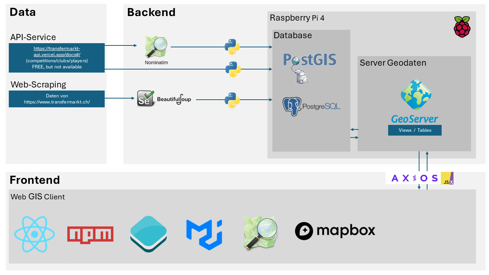

# GDI Projekt - Footballmap

Das ist die Projekt Website des *GDI Projekts*. Das GDI enthält eine Server und eine Client Umgebung.
- Server: FastAPI
- Client: React + OpenLayers

GitHub Repository: [https://github.com/314a/GDI_Project](https://github.com/314a/GDI_Project)

#### Projektteam

- [Nando Amport](https://github.com/naamp)
- [Stefan Sidler](https://github.com/StefanSidler95)
- [Silvan Baumeler](https://github.com/SilvanBaumeler)

# Inhaltsverzeichnis
- [GDI Projekt - Footballmap](#gdi-projekt---footballmap)
      - [Projektteam](#projektteam)
- [Inhaltsverzeichnis](#inhaltsverzeichnis)
- [Einleitung](#einleitung)
- [Erklärung der Funktionen von Football Map](#erklärung-der-funktionen-von-football-map)
  - [Startpage](#startpage)
    - [Funktionen:](#funktionen)
  - [Squad Overview](#squad-overview)
    - [Funktionen:](#funktionen-1)
  - [Transfer History](#transfer-history)
    - [Funktionen:](#funktionen-2)
- [Aufbau Geodateninfrastruktur (GDI)](#aufbau-geodateninfrastruktur-gdi)
  - [Backend](#backend)
    - [Grundlagedaten](#grundlagedaten)
      - [Datenabfrage über API-Schnittstelle](#datenabfrage-über-api-schnittstelle)
      - [Web-Scraping Squad Overview](#web-scraping-squad-overview)
      - [Web-Scraping Transfer History](#web-scraping-transfer-history)
      - [Web-Scraping aktuelle Liga Tabelle](#web-scraping-aktuelle-liga-tabelle)
    - [Datenbank und Datenbankschema](#datenbank-und-datenbankschema)
    - [Geoserver](#geoserver)
  - [Frontend](#frontend)
    - [UI Design](#ui-design)
    - [UX Design](#ux-design)
- [Ursprüngliches Konzept](#ursprüngliches-konzept)
    - [Aufbau Geodateninfrastruktur (GDI)](#aufbau-geodateninfrastruktur-gdi-1)
    - [Mockup](#mockup)
    - [Visualisierungsideen](#visualisierungsideen)
    - [User Persona](#user-persona)
- [Ausblick und Erweiterungsmöglichkeiten](#ausblick-und-erweiterungsmöglichkeiten)

# Einleitung
Im Vertiefungsmodul 4230 „Geoinformatik & Raumanalyse I“ des Bachelorstudiengangs Geomatik an der Fachhochschule Nordwestschweiz (FHNW) wurde eine Geodateninfrastruktur entwickelt. Das Thema konnte frei gewählt werden, musste jedoch räumlich-zeitliche Inhalte umfassen.

Auf dieser GitHub Page handelt es sich um die Geodateninfratstruktur "Football Map". Der Fussball ist enorm populär und generiert somit auch eine unglaubliche Menge an Daten. Die deutsche Bundesliga erfasst zum Beispiel 3.6 Millionen Positionsdatenpunkte pro Spiel (DFL Deutsche Fussball Liga GmbH 2024). Unzählige Portale und Applikationen zeigen die erfassten Daten live in Tabellen und Spielberichten an. Jedoch gibt es praktisch keine Webseite oder Applikation, welche die geografischen Daten integriert und auf einer interaktiven Karte darstellt.

Deshalb richtet sich die Football Map auf geografische Daten, in einem Bereich, in dem es bisher noch keine vergleichbaren Anwendungen für öffentliche Fussballdaten gibt.

Die Fussballmap ist ein Analyseplattform, welche speziell für Fussballfans entwickelt wurde. Diese dynamische thematische Karte ermöglicht es Ihnen, Fussballvereine aus den Top-Ligen Europas zu entdecken. Mit der Fussballmap können Sie:

- ***Geografische Betrachtung aller Clubs:***Betrachte die Fussballvereine auf einer Weltkarte und entdecke Clubs die dir noch unbekannt sind.
- ***Vereinsdetails erkunden:*** Blenden Sie das Spielerkader eines jeden Vereins ein und erhalten Sie Zugriff auf spannende Informationen.
- ***Transferhistorien analysieren:*** Betrachten Sie die Transferhistorie einzelner Spieler auf der Weltkarte, um ihre Karrierewege zu verfolgen.
- ***Mannschaftsherkunft interpretieren:*** Nutzen Sie thematische Karten, um die geografische Zusammensetzung und Herkunft der Mannschaften zu verstehen.

Die Football Map unterstützt derzeit die Funktionen Squad Overview, Player Origin und Transfer History ausschliesslich für die Schweizer Super League, da die zugrundeliegende Datenbank momentan nur Spielerdaten aus der Schweiz enthält. Die Datenbankstruktur ist jedoch so aufgebaut, dass sie problemlos mit Daten aus allen Ländern erweitert werden kann.

In den Nachfolgenden Kapiteln werden alle Funktionen der Football Map vorgestellt...

# Erklärung der Funktionen von Football Map
In diesem Abschnitt werden die Funktionen und Interaktionen der Fussballmap beschrieben

## Startpage
Auf der Startseite erscheint eine dynamische Karte, die auf die Schweiz fokussiert ist. Es werden die Clublogos entsprechend iherer geografischen Lage (Stadion) angezeit. Über die Toolbar können Nutzer aus 30 Ländern und 70 Ligen Clubs auswählen und filtern. Insgesamt sind 1060 Clubs in der Datenbank vorhanden.

Die Anzahl der Ligen pro Land variiert je nach Spielstärke. Für führende Fussballnationen sind die drei obersten Ligen verfügbar. Bei Ländern mit mittlerem Fussballniveau wurden die zwei höchsten Ligen einbezogen. In anderen Nationen ist jeweils nur die oberste Liga vertreten. Für die Schweiz hingegen wurden die fünf höchsten Ligen aufgenommen.

### Funktionen:
- Filtern nach Land und Liga mit der Möglichkeit mehrere Ligen eines Landes einzublenden (siehe Bild)
- Tabelle aller Stadion in einer Liga geordnet nach Stadionkapazität
- Mit Klick auf Clublogo wird der Stadiumname aufgerufen und es eröffnet weitere Funktionen: Squad Overview und Player Origin (siehe Bild)

 

## Squad Overview
Durch den entsprechenden Klick auf den Button Squadoverview, wie es im Kapitel Startpage beschrieben wurde, öffnet ein weiteres Fenster. In diesem Ausschnitt kann nun das entsprechende Kader betrachtet werden (siehe Bild). Ingesamt wurden 360 Spieler und 2880 Attribute (Spielerinformationen) aus der Schweizer Super League in der Datenbank erfasst.

### Funktionen:
- Dynamische Karte mit Zoomfunktion auf Club
- Tabelle mit Spielern des Clubs und Spielerinformationen (Shirt Nr., Name, Position, Foot, Height, Marketvalue, Age, Born)
- Durch den Klick auf Spieler ist ein weitere Funktionion (Transfer History) aufrufbar
- Ändern der Teamübersicht auf ein anderen Club mittels Auswahlmenü in der Toolbar

Bemerkung: Diese Informationen und Funktionen sind nur für Clubs aus der schweizerischen Super League, sowie deren Spieler möglich.

## Transfer History
Mit dem Entsprechenden Klick auf den Spieler (Seite Squad Overview), geht eine neue Seite auf. Die Seite Transfer History ermöglicht es den Transferweg eines Spielers zu betrachten. Dabei werden die Stationen mittels einer Linie dargestellt. Ist ein Club bei einem Transfer in der Datenbank nicht vorhanden, so wird das Land des Clubs mit dem Zentroid als Station verwendet.

### Funktionen:
- Transferströme unterteilt in

# Aufbau Geodateninfrastruktur (GDI)

Eine komplette Geodateninfrastruktur (GDI) besteht aus dem Backend, dem Frontend und den verwendeted Libraries und API Schnittstellen. Das folgende Schema zeigt die aufgebaute und verwendete Geodateninfrasturktur der FootballMap auf.

## Backend

Das Backend beinhaltet alle unsichtbaren Inhalte und Daten, die sich auf dem Server (bei uns Raspberry Pi) befinden. Dazu gehört auch der Bezug von Geodaten und sonstigen Daten über eine API-Schnittstelle oder per Web-Scraping. Das konzipierte Datenbankschema (siehe Bild unten) wurde mit postgres und postgis erstellt und die Daten wurden mittels Python-Skripts in die Datenbank eingepflegt. Der Geoserver ist das Bindeglied und der Bereitsteller der Datenbank. Mit Java Script React wird über den Geoserver auf die Daten zugegriffen und schlussendlich im Frontend dargestellt.

### Grundlagedaten

Um die erwähnten Funktionen der FootballMap umsetzten zu können, werden Fussballdaten benötigt. Ligen, Vereine, Stadien, Spieler und deren Transfers sollen in Form von strukturierten Daten erfasst und gespeichert werden. Transfermarkt.ch bietet seit 2001 eine Webseite mit umfassenden Daten rund um den Sport Fussball an. Die Grundlagedaten für die FootballMap beruhen deshalb auf Daten von Transfermarkt.ch.

#### Datenabfrage über API-Schnittstelle

Die Daten von Transfermarkt.ch konnten bis am 31. März 2024 über die API-Schnittstelle [Transfermarkt-API](https://transfermarkt-api.vercel.app/) bezogen werden. Liga-, Vereins- und Spielerdaten konnten über folgende Abfragen gefiltert und angezeigt werden. Der Zugang zu dieser API wurde nach dem 31. März 2024 geschlossen. Die Daten zu den Ligen, Vereinen und Stadien sind die Grundlage zur Darstellung der Club Logos auf der Startseite der FootballMap. Ausserdem werden diese Daten auch für die weiteren Funktionen [Squad Overview](#squad-overview) und [Transfer History](#transfer-history) benötigt.

***Beispielabfragen:***

- ***Suche eines Wettbewerbs (Liga):***
  `https://transfermarkt-api.vercel.app/competitions/search/Super%20League`

- ***Abfrage Vereine eines Wettbewerbs:***
  `https://transfermarkt-api.vercel.app/competitions/{Wettbewerbs_ID}/clubs`

- ***Abfrage Daten eines Vereins:***
  `https://transfermarkt-api.vercel.app/clubs/{Club_ID}/profile`

- ***Abfrage Spieler eines Vereins:***
  `https://transfermarkt-api.vercel.app/clubs/{Club_ID}/players`

- ***Abfrage Spielerprofil:***
  `https://transfermarkt-api.vercel.app/players/{Spieler_ID}/profile`

- ***Abfrage Transfers eines Spielers:***
  `https://transfermarkt-api.vercel.app/players/{Spieler_ID}/transfers`

Die Liga- und Vereinsdaten der FootballMap-Datenbank wurden über die Transfermarkt-API bezogen. Im Repository-Ordner (preprocessing/TransfermarktAPI_requests) befinden sich die Python-Skripts zur Abfrage und Speicherung der Daten. Es werden die Libraries [requests](https://pypi.org/project/requests/), [json](https://docs.python.org/3/library/json.html), [csv](https://docs.python.org/3/library/csv.html) und [pycopg2](https://pypi.org/project/psycopg2/) verwendet.

- `01_TM-API_AlleLigen_2_Liste_club_ids.py`
  - ***Grundlagedatei:*** JSON der Ligen jeweils mit dem Attribut Liga_nr
  - ***Zieldatei:*** Liste mit allen Club Nummern (Club_nr) aus jeder Liga (Liga_nr)
  - Es wurden die relevantesten Fussballländer in Europa mittels [UEFA Ranking](https://www.uefa.com/nationalassociations/uefarankings/country/?year=2024) ausgewählt
  - Von den besten fünf Ländern wurden jeweils die obersten drei Ligen ausgewählt, bei den weiteren 15 Ländern jeweils die obersten zwei Ligen, von weiteren 18 Ländern jeweils die oberste Liga
  - In der Schweiz wurden die obersten fünf Ligen mit einbezogen

- `02_TM-API_Liste_club_nr_2_JSON.py`
  - ***Grundlagedatei:*** Liste mit Club Nummern (Club_nr)
  - ***Zieldatei:*** JSON mit Club Informationen
  - Jeder Club wird abgefragt, um ein Clubprofil mit Attributen wie Clubname, Stadionname und Adresse zu erstellen

Im File 02 wird pro Club das Clubprofil abgerufen und die jeweiligen Attribute wie Clubname, Stadionname, Adresse werden abgefragt. Die Adresse und der Stadionname werden als Parameter einer Abfrage der [Nominatim API](https://nominatim.org/release-docs/develop/api/Search/) hinzugefügt. Die Nominatim API von Open Street Map lokalisiert die Stadien und die passenden Koordinaten werden im Clubprofil gespeichert. Falls mit den Parametern (Stadt, Stadionname und Typ="stadium") kein Eintrag gefunden wird, wird das Attribut Stadium_Coordinates mit dem Wert "None" abgefüllt. Die folgenden drei Python-Skripts verwenden andere Parameter, um einen passenden Eintrag zum jeweiligen Stadionnamen zu finden.

- `03_Koord_request_Nominatim_v1.py`
  - ***Parameter:*** Stadionname und Typ="stadium"

- `04_Koord_request_Nominatim_v2.py`
  - ***Parameter:*** Clubname und Typ="stadium"

- `05_Koord_request_Nominatim_v3.py`
  - ***Parameter:*** Stadtname und Country="country"

Falls bei der zweiten Abfrage keine Koordinaten gefunden werden, werden in der dritten Abfrage die Koordinaten der zugehörigen Stadt im Clubprofil gespeichert.
Die finalisierten Clubprofile werden entweder in eine CSV-Datei oder in eine JSON-Datei umgewandelt oder formatiert. Je nach weiterem Anwendungswunsch, kann zwischen CSV und JSON gewählt werden. Für den Import der Daten in die Datenbank wird ein weiteres Skript (07_Clubs_json2pg.py) verwendet.

- `06_Clubs_json_2_csv.py`
  - ***Grundlagedatei:*** JSON mit Clubprofilen inklusive Koordinaten
  - ***Zieldatei:*** CSV mit Clubprofilen

- `06_Clubs_json_2_json_formatiert.py`
  - ***Grundlagedatei:*** JSON mit Clubprofilen inklusive Koordinaten
  - ***Zieldatei:*** JSON mit Clubprofilen formatiert

- `07_Clubs_json_2_pg.py`
  - ***Grundlagedatei:*** JSON mit Clubprofilen inklusive Koordinaten
  - ***Ziel:*** Daten in Datenbank

Alle Spieler Nummern (Spieler_nr) von Spielern in der Schweizer Super League wurden mit der [Transfermarkt-API](https://transfermarkt-api.vercel.app/) abgefragt und gespeichert. Diese Liste dient als Grundlage für das Web-Scraping der Spielerdaten und der Transferdaten.

- `10_TM-API_AlleSpieler_CH_SuperLeague.py`
  - ***Grundlagedatei:*** Liste mit allen Club Nummern (Club_nr)
  - ***Ziel:*** JSON mit allen Spielern der angegebenen Club Nummern (club_nr)
  - Es wurden alle Spieler der Schweizer Super League in der Datenbank der FootballMap integriert. Die wirklich genutzten Spielerdaten stammen jedoch aus dem [Web-Scraping Sqad Overview](#web-scraping-squad-overview)

#### Web-Scraping Squad Overview

Das Ziel der Seite Squad Overview ist es, alle Spieler eines ausgewählten Vereins anzuzeigen. Von den Spielern sollten mehrere Informationen in einer Tabelle angezeigt werden, wie die Nationalität, Position, Trikotnummer, starker Fuss und Geburtsdatum. Die geforderten Informationen können nicht mehr über die API-Schnittstelle bezogen werden. Als Alternative wird die Technik [Web-Scraping](https://www.ionos.de/digitalguide/websites/web-entwicklung/was-ist-web-scraping/) angewendet. Es werden Daten von Webseiten über den HTML Code und den CSS-Klassen identifiziert und strukturiert abgespeichert. Für die Spielerdaten der FootballMap wurden die Inhalte von Transfermarkt.ch verwendet. Somit können die bestehenden Daten und die bereits verwendeten ID's von Transfermarkt.ch (Spieler_nr) weiterverwendet werden.

Um die oben beschriebenen Daten aus der Webseite zu extrahieren werden die Libraries [beautifulsoup](https://beautiful-soup-4.readthedocs.io/en/latest/), [requests](https://pypi.org/project/requests/) und [json](https://docs.python.org/3/library/json.html) verwendet.

- `04_scrape_playerdata.py`
  - ***Grundlagedatei:*** JSON mit allen Spielernummern (Spieler_nr)
  - ***Ziel:*** JSON mit Spielerprofilen. Attribute: "spieler_nr", "trikotnummer", "name", "geburtsort","geburtsland", "vereinsbeitritt", "vertragsende", "position", "starker_fuss", "geburtsdatum", "körpergrösse","nationalität", "marktwert", "vereinsnummer", "spielerbild_link"

Mit den Funktionen von [requests](https://pypi.org/project/requests/) wird pro Spieler die URL mit der Spieler_nr aufgerufen. Abfrage-URL: https://www.transfermarkt.ch/spielername/profil/spieler/{Spieler_nr}. Die Antwort der URL Abfrage wird mit [beautifulsoup](https://beautiful-soup-4.readthedocs.io/en/latest/) umgewandelt, sodass Daten aus den einzelnen HTML Elementen extrahiert werden können.

#### Web-Scraping Transfer History

Für die Seite `Transfer History` werden die Transferdaten jedes Spielers von der spezifischen Abfrage-URL [Transfermarkt](https://www.transfermarkt.ch/spielername/transfers/spieler/{Spieler_nr}) extrahiert. Die Standardabfrage mittels [BeautifulSoup](https://beautiful-soup-4.readthedocs.io/en/latest/) stösst jedoch aufgrund eines speziellen HTML-Elements (`<tm-transfer-history player-id="{spieler_nr}"></tm-transfer-history>`) auf Herausforderungen. Das HTML-Element `<tm-transfer-history>` . Daher wird für das Web-Scraping eine Kombination aus [Selenium](https://selenium-python.readthedocs.io/) und BeautifulSoup verwendet.

Der Web-Scraping-Prozess erfolgt durch ein [Jupyter Notebook](https://docs.jupyter.org/en/latest/) und nutzt Funktionen der Libraries Selenium und BeautifulSoup:

- ***Notebook:*** `01_Transfermarkt_Transferdata_Notebook.ipynb`
  - ***Ausgangsdatei:*** Liste der Spielernummern (Spieler_nr)
  - ***Ziel:*** CSV mit einer Zeile pro Transfer, die Attribute wie Spieler-Nr., Saison, Datum, abgebender Verein, Name des alten Clubs, aufnehmender Verein, Name des neuen Clubs, Marktwert und Ablösesumme enthält.

Mit Selenium wird ein automatisierter Webdriver betrieben, der durch das Jupyter Notebook gesteuert wird. Es navigiert zur spezifischen Abfrage-URL, integriert eine Wartezeit und akzeptiert die Cookies. Die Datenextraktion erfolgt erneut über BeautifulSoup, wobei die Attribute jeder Tabellenzeile gesichert werden.

Die Attribute für das Ursprungs- und Zielland der Clubs (`old_club_country` und `new_club_country`) wurden manuell zu jedem Transfer hinzugefügt, da diese nicht direkt aus der Tabelle entnommen werden konnten. Eine Erweiterung des Jupyter Notebooks könnte eine verbesserte Navigation einschließen, um diese Informationen automatisch aus den Clubseiten auf [Transfermarkt](https://www.transfermarkt.ch/{Vereinsname}/stadion/verein/{Club_nr}/saison_id/2023) zu ziehen. Ein weiterer Ansatz, das Land des Clubs mittels der [Nominatim API](https://nominatim.org/release-docs/develop/api/Search/) zu ermitteln, schlug fehl, da nur für etwa 10% der Clubs entsprechende Einträge gefunden wurden. Diese Verknüpfung des Landes mit dem Club ist in der Datenbank vorhanden, jedoch sind nicht alle globalen Vereine in der FootballMap-Datenbank erfasst, was bei der Darstellung der Transferhistorie zu Datenlücken führen kann.

#### Web-Scraping aktuelle Liga Tabelle

### Datenbank und Datenbankschema

### Geoserver

## Frontend

### React
Wie greift React mit Axios auf die Daten(Geoserver) zu

### Open Layers
Wie werden die Daten des Geoservers mit OL dargestellt?

### UI Design

Das User Interface (UI) Design konzentriert sich darauf, wie die Website optisch gestaltet ist und wie die Benutzerelemente angeordnet sind. Für die Footballmap wurde ein klares, sportliches Design gewählt, das durch die Verwendung von dynamischen Karten und Clublogos, die geografische Daten repräsentieren, verstärkt wird. Die visuelle Darstellung auf der Startseite und in den verschiedenen Funktionsbereichen wie "Squad Overview" und "Transfer History" verwendet eine Kombination aus Icons, Menüleisten und interaktiven Karten, die intuitiv und leicht zugänglich sind. Farben und Schriftarten sind so gewählt, dass sie Lesbarkeit verbessern und gleichzeitig ein Gefühl von Energie und Bewegung vermitteln.

### UX Design

Das User Experience (UX) Design der Footballmap zielt darauf ab, eine nahtlose und engagierte Nutzererfahrung zu schaffen. Dies wird durch eine durchdachte Benutzerführung erreicht, die es den Nutzern ermöglicht, schnell und effizient durch die verschiedenen Funktionen der Plattform zu navigieren. Die interaktiven Elemente, wie das Klicken auf Clublogos, um detaillierte Informationen zu einem Club oder Spieler zu erhalten, sind logisch und vorhersehbar gestaltet. Der Übergang zwischen den einzelnen Seiten und Funktionen ist fließend, wodurch die Nutzer engagiert bleiben und leicht verstehen können, wie sie die benötigten Informationen abrufen können. Die Anpassung der Informationsdarstellung an die Bedürfnisse der Benutzer, wie z.B. die Filterung nach Ligen oder Ländern, verbessert das Gesamterlebnis und erhöht die Benutzerzufriedenheit.

# Ursprüngliches Konzept

In diesem Kapitel werden die ersten Ideen und Entwürfe des Aufbaus und der Gestaltung

### Aufbau Geodateninfrastruktur (GDI)

### Mockup

### Visualisierungsideen

### User Persona

# Ausblick und Erweiterungsmöglichkeiten

### Allgemein

### Startpage
Für die [Startpage](#startpage) bestehen folgenden Punkte und Fuktionen für Erweiterungen in der Zukunft.
  -***Weitere Länder und Ligen in den Dropdowns zur Verfügung***
  -***Map Control: "Extend to Features" Ausdehnung der Karte auf ausgewählte Daten anpassen***
  -

### Squad Overview
[Squad Overview](#squad-overview)

### Transfer History
[Transfer History](#transfer-history)

360 Spieler

[Zurück nach oben](#top)