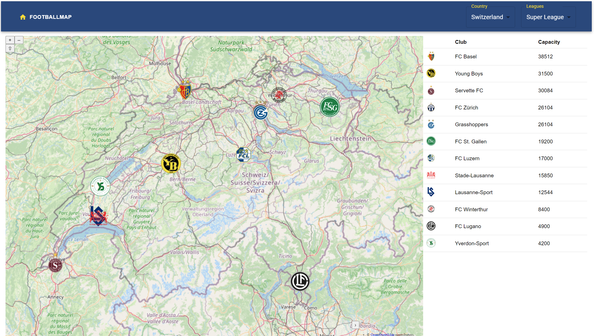

# GDI Projekt - Footballmap

Das ist die Projekt Website des *GDI Projekts*. Das GDI enthält eine Server und eine Client Umgebung.
- Server: FastAPI
- Client: React + OpenLayers

GitHub Repository: [https://github.com/314a/GDI_Project](https://github.com/314a/GDI_Project)

## Inhaltsverzeichnis
- [Einleitung](./dokumentation)
- [Startseite](./index)
- [Spielerdaten](./spielerdaten)
- [Spielerherkunft](./spielerherkunft)
- [Spielertransfer](./spielertransfer)

## Einleitung
Im Vertiefungsmodul 4230 „Geoinformatik & Raumanalyse I“ des Bachelorstudiengangs Geomatik an der Fachhochschule Nordwestschweiz (FHNW) wurde eine Geodateninfrastruktur entwickelt. Das Thema konnte frei gewählt werden, musste jedoch räumlich-zeitliche Inhalte umfassen.

Auf dieser GitHub Page handelt es sich um die Geodateninfratstruktur "Football Map". Der Fussball ist enorm populär und generiert somit auch eine unglaubliche Menge an Daten. Die deutsche Bundesliga erfasst zum Beispiel 3.6 Millionen Positionsdatenpunkte pro Spiel (DFL Deutsche Fussball Liga GmbH 2024). Unzählige Portale und Applikationen zeigen die erfassten Daten live in Tabellen und Spielberichten an. Jedoch gibt es praktisch keine Webseite oder Applikation, welche die geografischen Daten integriert und auf einer interaktiven Karte darstellt.

Deshalb befasst sich die Football Map mit den geografischen Daten, welche noch nachholbedarf im Bereich öffentliche Fussballdaten hat.

Die Fussballmap ist ein Analyseplattform, welche speziell für Fussballfans entwickelt wurde. Diese dynamische thematische Karte ermöglicht es Ihnen, Fussballvereine aus den Top-Ligen Europas zu entdecken. Mit der Fussballmap können Sie:

- **Geografische Betrachtung aller Clubs:**Betrachte die Fussballvereine auf deiner Weltkarte und entdecke Clubs die dir noch unbekannt sind.
- **Vereinsdetails erkunden:** Blenden Sie das Spielerkader eines jeden Vereins ein und erhalten Sie Zugriff auf spannende Informationen.
- **Transferhistorien analysieren:** Betrachten Sie die Transferhistorie einzelner Spieler auf der Weltkarte, um ihre Karrierewege zu verfolgen.
- **Mannschaftsherkunft interpretieren:** Nutzen Sie thematische Karten, um die geografische Zusammensetzung und Herkunft der Mannschaften zu verstehen.

In den Nachfolgenden Kapiteln werden alle Funktionen der Football Map vorgestellt...

### Projektteam

- [Nando Amport](https://github.com/naamp)
- [Stefan Sidler](https://github.com/StefanSidler95)
- [Silvan Baumeler](https://github.com/SilvanBaumeler)
