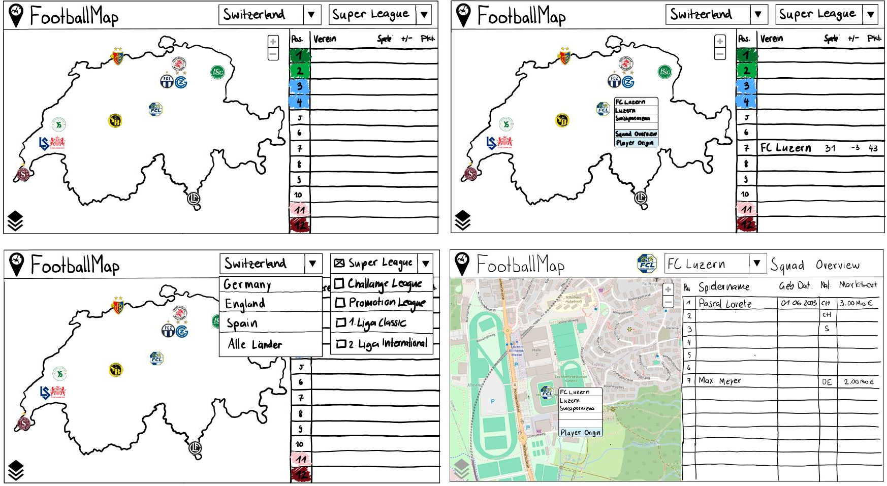
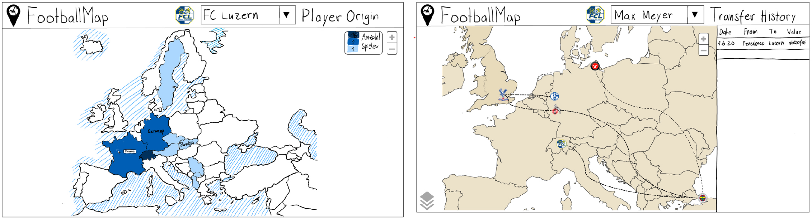

# Ursprüngliches Konzept

In diesem Kapitel werden die ersten Ideen des Aufbaus und der Gestaltung der FootballMap beschrieben. Die Konzeptphase erfolgte vor der Datenbeschaffung und der Entwicklung des Frontend.

### Aufbau Geodateninfrastruktur (GDI)

Im folgenden Bild ist ein erster Entwurf der Architektur der GDI zu sehen. Während der beschaffung der Daten und des Erstellens der Oberfläche entstanden Herausforderungen, die schlussendlich anders als geplant gelöst wurden. Auch konnten einige Prozesse einfacher als geplant gelöst werden. Die finale Architektur der GDI ist [hier](#gdi-final) sichtbar.

### Mockup

Bevor mit der technischen Umsetzung des Frontends begonnen wurde, wurde zunächst ein Konzept für das User-Interface skizziert. Besondere Aufmerksamkeit wurde der Gestaltung der Visualisierungen gewidmet, um sicherzustellen, dass diese für die Anwender intuitiv, einfach und vor allem verständlich sind. Durch die vielen Überlegungen im Vorfeld konnten zahlreiche Fragen und Probleme bereits bei der Erstellung des Mockups geklärt werden, was die Entwicklung des Frontends erheblich vereinfachte. Zudem ist anzumerken, dass das Ergebnis nicht stark vom skizzierten Mockup abweicht. Die nachfolgenden Abbildungen zeigen das Mockup, wobei sich einige Features und Darstellungsmerkmale in der endgültigen Version noch unterscheiden können.

***Abweichungen bezüglich Endprodukt:***
- Die Ligatabelle wurde auf der Startseite weggelassen und mit einer Liste aller Clubs (einer Liga), sortiert nach Stadiongrösse, ersetzt. Dies wurde deshalb gemacht, da diese Information zu den aktuellen Spielen nicht mit dem Sinn und Konzept der anderen Features übereinpasst.
- Auf der Seite "Player Origin" wurde eine Ländertabelle ergänzt, die nach der Anzahl Spieler pro Land sortiert ist. Diese Ergänzung sorgt einerseits für ein konsistentes Design über alle Seiten hinweg und gewährleistet andererseits, dass alle Herkunftsländer in der Tabelle erfasst sind. Da Europa als Standardzoomstufe verwendet wird, werden durch diese Massnahme auch aussereuropäische Länder berücksichtigt.
- Auf der Seite Transferhistory wurden die Transferwege linear und nicht als geodätische Linien dargestellt.
- Zusätzlich wurden in allen Tabellen weitere Attribute ergänzt, darunter Spielerbilder, Landesflaggen und Clublogos.

### Visualisierungsideen
Es wurden Visualisierungsideen aus den sozialen Medien und aus dem Internet gesammelt. Vorallem die Funktion und Anzeige der [Transferhistorie](funktionen.md#transfer-history) ist durch die Inspiration von statischen Visualisierungen der Transferhistorie einzelner Spieler entstanden. Es war die Idee von allen Spielern der Schweizer Super League eine dynamische Karte der Transferwege zu erstellen.

[↑](#top)

  

    <a href="aufbauGDI.html">← Aufbau GDI</a>
  

  

    <a href="ausblick.html">Erweiterungsmöglichkeiten →</a>
  

